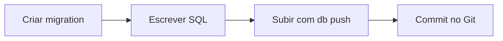
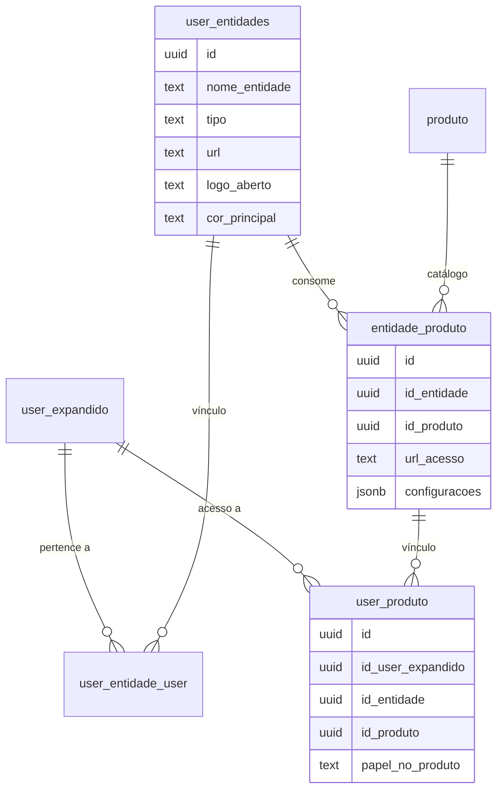

# Arquitetura do Banco de Dados — EduClick

> Stack: **PostgreSQL (via Supabase)** | Migrações versionadas via CLI | RPCs `SECURITY INVOKER` | RLS

---

## Sumário

- [1. Stack e Ferramentas](#1-stack-e-ferramentas)
  - [1.1 Configuração Inicial da CLI Supabase](#11-configuração-inicial-da-cli-supabase)
  - [1.2 Fluxo de Migrations](#12-fluxo-de-migrations)
  - [1.3 Ferramental Recomendado](#13-ferramental-recomendado)
- [2. Modelo de Dados — Entidades e Produtos](#2-modelo-de-dados--entidades-e-produtos)
  - [2.1 Diagrama de Relacionamentos (ER)](#21-diagrama-de-relacionamentos-er)
  - [2.2 Principais Mudanças Arquiteturais](#22-principais-mudanças-arquiteturais)
- [3. Gestão de Sessão (BFF)](#3-gestão-de-sessão-bff)
  - [3.1 RPC `nxt_get_user_session_v1`](#31-rpc-nxt_get_user_session_v1)
  - [3.2 Endpoint `/api/me`](#32-endpoint-apime)
- [4. Módulo Acadêmico — RPCs](#4-módulo-acadêmico--rpcs)
  - [4.1 CRUD de Componentes](#41-crud-de-componentes)
- [5. Como Adicionar um Novo Produto](#5-como-adicionar-um-novo-produto)
- [6. Histórico de Revisão](#6-histórico-de-revisão)

---

## 1. Stack e Ferramentas

| Componente | Tecnologia |
|---|---|
| **Banco de dados** | PostgreSQL 15 (via Supabase) |
| **Autenticação** | Supabase Auth + JWT com custom claims |
| **CLI** | Supabase CLI (gerenciamento local + migrações) |
| **Migrations** | SQL versionado em `supabase/migrations/` |
| **Edge Functions** | Supabase Edge Functions (webhooks, bg tasks) |

### 1.1 Configuração Inicial da CLI Supabase

#### Login

Se é a primeira vez usando a CLI do Supabase na máquina:

```powershell
supabase login
```

Isso abrirá o navegador. Clique em "Confirm" para gerar o token.

#### Vincular Projeto (Link)

Vincule o repositório local ao projeto remoto na nuvem:

```powershell
supabase link --project-ref <seu-project-ref>
```

> **Project Ref**: encontre no dashboard do Supabase em Project Settings > General > Reference ID, ou na URL: `https://supabase.com/dashboard/project/abcde12345...`

O comando solicitará a senha do banco de dados (Database Password) do projeto remoto.

> Se ainda não configurou o GitHub, execute também: `supabase migration repair --status applied <codigo_da_migration_criada_automaticamente>`

#### Primeiro Pull

Baixe o esquema do banco remoto para o ambiente local:

```powershell
supabase db pull
```

Isso cria/atualiza o arquivo de migração inicial dentro de `supabase/migrations/`.

### 1.2 Fluxo de Migrations

**NUNCA** altere o banco diretamente pelo Dashboard Web para coisas estruturais. Siga este fluxo:



#### Passo a passo

1. **Criar nova migração**:
   ```powershell
   npx supabase migration new nome_da_alteracao
   ```
   Cria um arquivo timestamped em `supabase/migrations/`.

2. **Escrever o SQL**:
   Edite o arquivo gerado com os comandos `CREATE TABLE`, `ALTER TABLE`, etc.

3. **Subir para o Supabase**:
   ```powershell
   npx supabase db push
   ```

4. **Git**:
   Faça `git push` para salvar o código da migração no repositório. O Git salva o histórico, mas o `db push` é o que altera o banco real.

#### Convenções

- Toda RPC: `SECURITY INVOKER` (exceção: hooks de auth).
- Segurança via **RLS** nas tabelas, não na função.
- Migrations com timestamp: `YYYYMMDDHHMMSS_descricao.sql`.

#### Resumo dos Comandos

```powershell
# Login
supabase login

# Vincular ao projeto remoto
supabase link --project-ref <seu-project-ref>

# Baixar estrutura do banco
supabase db pull

# Criar nova migration
npx supabase migration new descricao

# Subir alterações
npx supabase db push
```

### 1.3 Ferramental Recomendado

| Ferramenta | Uso |
|---|---|
| **Dashboard Web** | Gerenciar RLS, Auth e Storage |
| **Extensão PostgreSQL (VS Code)** | Consultas rápidas (porta 5432) |
| **Supabase Studio Local** | `localhost:54323` após `npx supabase start` |

> **Dica**: Se a extensão do VS Code desconectar, tente usar o comando `PostgreSQL: Connect` ou reinicie a sessão dando Refresh no servidor. Use o Docker Desktop apenas quando for rodar o Supabase localmente ou fazer `db pull`. Para apenas codar o frontend, ele não precisa estar ligado.

---

## 2. Modelo de Dados — Entidades e Produtos

O sistema evoluiu de um modelo focado em `Empresa` para um modelo baseado em **Entidades**. Agora, uma **Entidade** (Empresa ou Família) pode estar vinculada a múltiplos **Produtos** (Acadêmico, Financeiro, etc.).

### 2.1 Diagrama de Relacionamentos (ER)



### 2.2 Principais Mudanças Arquiteturais

- **Unificação**: A tabela `public.empresa` foi integrada à `public.user_entidades`.
- **Refactoring**: Todas as tabelas acadêmicas (`aca_*`) agora utilizam `id_entidade` como chave estrangeira principal.
- **Roteamento por URL**: A tabela `entidade_produto` armazena a `url_acesso`, permitindo que URLs diferentes levem a contextos diferentes de Produto + Entidade.

> **Permissões:** o modelo de permissões por entidade × papel × produto (`app_permissoes`, enriquecimento de `user_entidades`, papel por entidade em `user_papeis_auth`) está em `documentacao/arquitetura/permissoes.md`.

---

## 3. Gestão de Sessão (BFF)

A sessão do usuário no front-end (Nuxt) foi sofisticada para carregar toda a hierarquia de acesso em uma única chamada.

### 3.1 RPC `nxt_get_user_session_v1`

Consolida os dados do usuário e suas permissões.

- **Entrada**: `p_auth_id` (UUID do Supabase Auth)
- **Retorno (JSON)**:

```json
{
  "usuario": {
    "id": "...",
    "nome_completo": "...",
    "email": "..."
  },
  "entidades": [
    {
      "id": "...",
      "nome_entidade": "...",
      "branding": {
        "logo": "...",
        "cores": "..."
      },
      "produtos": [
        {
          "slug": "academico",
          "url_acesso": "..."
        }
      ]
    }
  ]
}
```

### 3.2 Endpoint `/api/me`

O BFF consome o RPC acima e disponibiliza o contexto completo para a `AppStore`.

---

## 4. Módulo Acadêmico — RPCs

### 4.1 CRUD de Componentes

Foram implementados os primeiros CRUDs utilizando o padrão de RPCs com retorno JSONB.

| RPC | Descrição |
|---|---|
| `aca_upsert_componente` | Cadastro e edição de matérias |
| `aca_get_componentes_paginado` | Listagem com busca (`unaccent`), ordenação e paginação |
| `aca_delete_componente` | Exclusão lógica/segura por entidade |

---

## 5. Como Adicionar um Novo Produto

1. Cadastrar o produto na tabela `public.produto`.
2. Vincular uma entidade ao produto via `public.entidade_produto`, definindo a `url_acesso`.
3. O RPC `aca_get_contexto_por_url` resolverá automaticamente o contexto ao carregar o app.

---

## 6. Histórico de Revisão

| Data | Descrição |
|---|---|
| 2026-08-21 | Adicionada referência ao modelo de permissões (`documentacao/arquitetura/permissoes.md`) — Fase A de multientidade |
| 2026-07-23 | Consolidação dos documentos: `SUPABASE_SETUP.md`, `SUPABASE_WORKFLOW.md`, `arquitetura_sistema.md`, `jwt.md` (vazio/placeholder) em documento único de arquitetura de banco de dados |

---

_Consolidado a partir de: `SUPABASE_SETUP.md`, `SUPABASE_WORKFLOW.md`, `arquitetura_sistema.md`, `jwt.md`_
