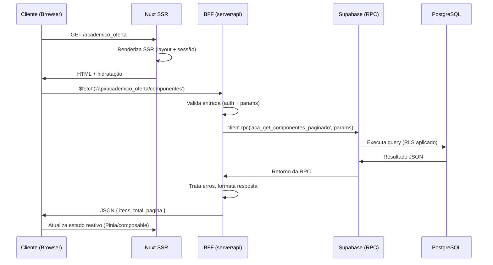
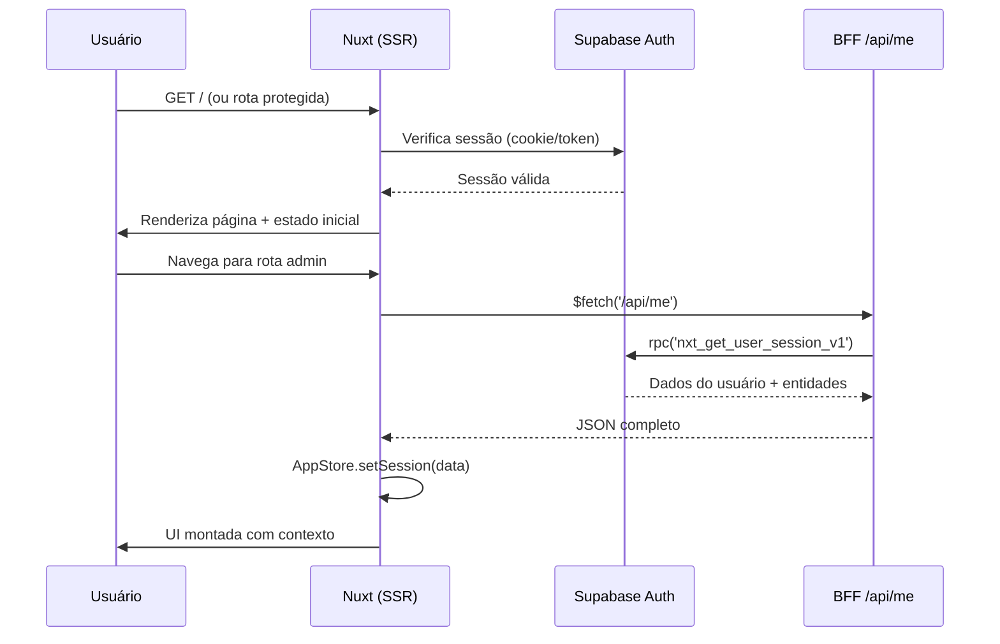

# Arquitetura do Servidor — SSR & BFF — EduClick

> Stack: **Nuxt 3 Server Engine** → **Supabase (RPCs)** → **Cloudflare Pages + R2 + Workers**
> Localização: `front_end/server/api/<dominio>/`

---

## Sumário

- [1. Stack e Visão Geral](#1-stack-e-visão-geral)
- [2. Pipeline de Requisição](#2-pipeline-de-requisição)
- [3. Estrutura de BFFs](#3-estrutura-de-bffs)
  - [3.1 Organização por Domínio](#31-organização-por-domínio)
  - [3.2 APIs Globais vs Específicas](#32-apis-globais-vs-específicas)
  - [3.3 Inventário de Endpoints](#33-inventário-de-endpoints)
- [4. Gestão de Sessão](#4-gestão-de-sessão)
  - [4.1 RPC `nxt_get_user_session_v1`](#41-rpc-nxt_get_user_session_v1)
  - [4.2 Endpoint `/api/me`](#42-endpoint-apime)
  - [4.3 Fluxo de Autenticação](#43-fluxo-de-autenticação)
- [5. Padrões de Implementação](#5-padrões-de-implementação)
  - [5.1 BFF por Domínio (Isolamento de API)](#51-bff-por-domínio-isolamento-de-api)
  - [5.2 RPC para Tudo — Query Direta só em Fluxo Deslogado](#52-rpc-para-tudo--query-direta-só-em-fluxo-deslogado)
  - [5.3 Validação no Front Antes do BFF](#53-validação-no-front-antes-do-bff)
  - [5.4 Tratamento de Erros no BFF](#54-tratamento-de-erros-no-bff)
  - [5.5 Modal com `onSave` como Prop](#55-modal-com-onsave-como-prop)
  - [5.6 Estrutura Padrão de um BFF](#56-estrutura-padrão-de-um-bff)
  - [5.7 Padrão Composable com `useAsyncData` + `ofetch` + Ref de Entidade](#57-padrão-composable-com-useasyncdata--ofetch--ref-de-entidade)
- [6. SSR (Server-Side Rendering)](#6-ssr-server-side-rendering)
  - [6.1 Configuração de Autenticação](#61-configuração-de-autenticação)
  - [6.2 Cuidados com Hydration](#62-cuidados-com-hydration)
  - [6.3 `initialTab` no Setup, não no `onMounted`](#63-initialtab-no-setup-não-no-onmounted)
- [7. Boas Práticas e Lições Aprendidas](#7-boas-práticas-e-lições-aprendidas)
  - [7.1 `$fetch` do `ofetch` — Quando Usar e Quando Evitar](#71-fetch-do-ofetch--quando-usar-e-quando-evitar)
  - [7.2 APIs Específicas → `server/api/<pagina>/`](#72-apis-específicas--server-apipagina)
  - [7.3 Deep Linking (Sincronização com URL)](#73-deep-linking-sincronização-com-url)
  - [7.4 Blindagem de Contexto (Context Shielding)](#74-blindagem-de-contexto-context-shielding)
- [8. Histórico de Revisão](#8-histórico-de-revisão)

---

## 1. Stack e Visão Geral

| Camada | Tecnologia | Localização |
|---|---|---|
| **Servidor SSR** | Nuxt 3 Server Engine | `front_end/server/` |
| **BFFs (APIs)** | Nuxt Server Routes (`/server/api`) | `front_end/server/api/<dominio>/` |
| **Banco de dados** | PostgreSQL (via Supabase) | `supabase/migrations/` |
| **Autenticação** | Supabase Auth + JWT custom claims | `@nuxtjs/supabase` |
| **File storage** | Cloudflare R2 | `workers/` |
| **Proxy / signed URLs** | Cloudflare Workers | `workers/src/` |
| **Webhooks / bg tasks** | Supabase Edge Functions | `supabase/functions/` |
| **Deploy** | Cloudflare Pages | `wrangler.toml` |

### Fluxo de Deploy

```
Nuxt 3 (front_end/) → build → Cloudflare Pages
  └── server/api/    → deploy como serverless functions (CF Pages)
  └── app/           → deploy como static assets (CF Pages)
```

---

## 2. Pipeline de Requisição

```
Cliente (navegador)
  → Nuxt SSR (server/) — renderiza página
    → BFF (server/api/<dominio>/<metodo>.<method>.ts)
      → Cliente Supabase (server client)
        → RPC (SECURITY INVOKER)
          → PostgreSQL
```

### Fluxo detalhado



### Responsabilidades de cada camada

| Camada | O que faz | O que NÃO faz |
|---|---|---|
| `pages/<dominio>/index.vue` | Inicializa sessão, chama composables, monta template | Lógica de negócio, `$fetch` direto |
| `composables/<dominio>/` | Fetch, filtros, paginação, estado reativo | Importar Vue Router |
| **`server/api/<dominio>/`** | **Valida entrada, chama RPC, retorna JSON** | **Lógica complexa de negócio** |
| `supabase/migrations/` | RPCs `SECURITY INVOKER`, RLS | Nunca mexer pelo dashboard |

> A lógica de negócio complexa deve ficar nas **RPCs** do banco, não nos BFFs. O BFF é uma camada fina de orquestração e validação.

---

## 3. Estrutura de BFFs

### 3.1 Organização por Domínio

Cada domínio de negócio tem sua própria pasta em `server/api/`, espelhando a estrutura do frontend:

```
server/api/
├── academico_oferta/       ← Módulo acadêmico (Estrutura)
│   ├── areas.get.ts
│   ├── areas.post.ts
│   ├── areas.delete.ts
│   ├── componentes.get.ts
│   ├── componentes.post.ts
│   ├── componentes.delete.ts
│   ├── modulos.get.ts
│   ├── modulos.post.ts
│   ├── modulos.delete.ts
│   ├── cursos.get.ts
│   ├── cursos.post.ts
│   ├── cursos.delete.ts
│   ├── ciclos.get.ts
│   ├── ciclos.post.ts
│   ├── programas.get.ts
│   ├── plano_aula.get.ts
│   ├── plano_aula.post.ts
│   ├── plano_aula.delete.ts
│   └── ciclos/
│       └── calcular_cronograma.post.ts
│
├── matriculas/
│   ├── index.get.ts
│   ├── lista.get.ts
│   ├── detalhes.get.ts
│   ├── inativar.post.ts
│   └── turmas.get.ts
│
├── processos/
│   ├── index.get.ts
│   ├── inscricoes.get.ts
│   ├── detalhes.get.ts
│   └── avaliar.post.ts
│
├── formularios/            ← (em desenvolvimento)
├── meus-processos/         ← (em desenvolvimento)
├── docentes/               ← (em desenvolvimento)
├── calendario/             ← (em desenvolvimento)
├── comercial/              ← (em desenvolvimento)
├── admin/                  ← (em desenvolvimento)
├── auth/                   ← (em desenvolvimento)
│
├── r2/
│   └── sign.get.ts         ← Signed URLs para Cloudflare R2
│
├── public/                 ← Endpoints públicos (sem auth)
│
├── areas.get.ts            ← Global (compartilhado entre páginas)
├── areas.post.ts
├── areas.delete.ts
├── ciclos.get.ts
├── ciclos.post.ts
├── programas.get.ts
├── programas.post.ts
├── me.get.ts               ← Sessão do usuário
├── odoo-lead.post.ts       ← Integração Odoo
├── debug.ts                ← Debug
└── refresh-hash.ts         ← Refresh de hash
```

### 3.2 APIs Globais vs Específicas

| Tipo | Onde fica | Quando usar |
|---|---|---|
| **Específica** | `server/api/<pagina>/` | Consumida por apenas uma página |
| **Global** | `server/api/` (raiz) | Compartilhada entre múltiplas páginas |

> **Como auditar:** `grep -rl "/api/xxx" front_end/app/` — se só aparece em uma página, move para subpasta.

### 3.3 Inventário de Endpoints

#### Domínio `academico_oferta/`

| Endpoint | Método | Descrição |
|---|---|---|
| `areas.get.ts` | GET | Listar áreas |
| `areas.post.ts` | POST | Criar/atualizar área |
| `areas.delete.ts` | DELETE | Excluir área |
| `componentes.get.ts` | GET | Listar componentes |
| `componentes.post.ts` | POST | Criar/atualizar componente |
| `componentes.delete.ts` | DELETE | Excluir componente |
| `modulos.get.ts` | GET | Listar módulos |
| `modulos.post.ts` | POST | Criar/atualizar módulo |
| `modulos.delete.ts` | DELETE | Excluir módulo |
| `cursos.get.ts` | GET | Listar cursos |
| `cursos.post.ts` | POST | Criar/atualizar curso |
| `cursos.delete.ts` | DELETE | Excluir curso |
| `ciclos.get.ts` | GET | Listar ciclos |
| `ciclos.post.ts` | POST | Criar/atualizar ciclo |
| `programas.get.ts` | GET | Listar programas |
| `plano_aula.get.ts` | GET | Listar planos de aula |
| `plano_aula.post.ts` | POST | Criar/atualizar plano de aula |
| `plano_aula.delete.ts` | DELETE | Excluir plano de aula |
| `ciclos/calcular_cronograma.post.ts` | POST | Calcular cronograma de aulas |

#### Domínio `matriculas/`

| Endpoint | Método | Descrição |
|---|---|---|
| `index.get.ts` | GET | Dashboard de matrículas |
| `lista.get.ts` | GET | Lista paginada de matrículas |
| `detalhes.get.ts` | GET | Detalhes de uma matrícula |
| `inativar.post.ts` | POST | Inativar matrícula |
| `turmas.get.ts` | GET | Listar turmas |

#### Domínio `processos/`

| Endpoint | Método | Descrição |
|---|---|---|
| `index.get.ts` | GET | Dashboard de processos |
| `inscricoes.get.ts` | GET | Lista de inscrições |
| `detalhes.get.ts` | GET | Detalhes de um processo |
| `avaliar.post.ts` | POST | Avaliar candidato |

#### Endpoints Globais (raiz)

| Endpoint | Método | Descrição |
|---|---|---|
| `areas.get.ts` | GET | Áreas (compartilhado) |
| `areas.post.ts` | POST | Criar/atualizar área |
| `areas.delete.ts` | DELETE | Excluir área |
| `ciclos.get.ts` | GET | Ciclos (compartilhado) |
| `ciclos.post.ts` | POST | Criar/atualizar ciclo |
| `programas.get.ts` | GET | Programas (compartilhado) |
| `programas.post.ts` | POST | Criar/atualizar programa |
| `me.get.ts` | GET | Sessão do usuário logado |
| `odoo-lead.post.ts` | POST | Integração com Odoo (leads) |
| `r2/sign.get.ts` | GET | Signed URL para Cloudflare R2 |
| `debug.ts` | GET | Debug |
| `refresh-hash.ts` | POST | Refresh de hash |

---

## 4. Gestão de Sessão

A sessão do usuário é carregada em uma única chamada que consolida toda a hierarquia de acesso.

### 4.1 RPC `nxt_get_user_session_v1`

**Localização:** `supabase/migrations/` (RPC)

Consolida os dados do usuário e suas permissões.

- **Entrada:** `p_auth_id` (UUID do Supabase Auth)
- **Tipo:** `SECURITY INVOKER`
- **Retorno (JSON):**

```json
{
  "usuario": {
    "id": "...",
    "nome_completo": "...",
    "email": "..."
  },
  "entidades": [
    {
      "id": "...",
      "nome_entidade": "...",
      "branding": {
        "logo": "...",
        "cores": "..."
      },
      "produtos": [
        {
          "slug": "academico",
          "url_acesso": "..."
        }
      ]
    }
  ]
}
```

### 4.2 Endpoint `/api/me`

**Localização:** `front_end/server/api/me.get.ts`

O BFF `/api/me` consome a RPC `nxt_get_user_session_v1` e retorna o contexto completo para a `AppStore` (Pinia).

**Fluxo:**

```
AppStore.initSession()
  → $fetch('/api/me')
    → server/api/me.get.ts
      → client.rpc('nxt_get_user_session_v1', { p_auth_id })
        → Retorna JSON com usuário + entidades + produtos
```

### 4.3 Fluxo de Autenticação



**Rotas de autenticação configuradas no `nuxt.config.ts`:**

| Rota | Tipo |
|---|---|
| `/auth/login` | 🔓 Pública |
| `/auth/cadastro` | 🔓 Pública |
| `/auth/recuperar_senha` | 🔓 Pública |
| `/auth/trocar_senha` | 🔓 Pública |
| `/confirm` | 🔓 Callback de confirmação |
| `/` | 🔓 Pública (landing) |
| Demais rotas | 🔒 Requer login |

---

## 5. Padrões de Implementação

### 5.1 BFF por Domínio (Isolamento de API)

Não centralize todas as chamadas de API do sistema em arquivos gigantes. Cada módulo desacoplado deve ter sua estrutura de pastas no servidor que espelhe o front.

```
server/api/
└── grupos_estudo/           ← Pasta dedicada
    ├── grupos.get.ts
    ├── grupos.post.ts
    └── tutores.delete.ts
```

**Benefícios:**
- Isola erros — uma falha em um módulo não afeta outros
- Facilita manutenção — cada time/desenvolvedor cuida de sua pasta
- Clareza — a estrutura do servidor reflete a estrutura do frontend

### 5.2 RPC para Tudo — Query Direta só em Fluxo Deslogado

Toda leitura/escrita em tabelas deve passar por **BFF → RPC**, nunca query direta ao Supabase via `.from('tabela').select(...)`.

```
✅ BFF → (client as any).rpc('minha_rpc', params)
❌ BFF → client.from('tabela').select('id, nome')
```

A única exceção são fluxos de **onboarding** (ex: `/convite`) onde o usuário ainda não está autenticado e o RLS não permite acesso via RPC.

**Motivos:**
- RPCs com `SECURITY INVOKER` respeitam o RLS
- Centraliza a lógica de negócio no banco
- Evita exposição acidental de dados sensíveis via PostgREST

### 5.3 Validação no Front Antes do BFF

Erros de constraint do banco (`duplicate key`, `not-null`) são confusos para o usuário. Sempre valide campos obrigatórios **no front** antes de enviar ao BFF:

```typescript
const handleSave = async () => {
  if (!formDados.value.nome_completo) {
    errorMessage.value = 'Nome completo é obrigatório.'
    return
  }
  if (!formDados.value.matricula || !formDados.value.matricula.trim()) {
    errorMessage.value = 'Matrícula é obrigatória.'
    return
  }
  // ... enviar ao BFF
}
```

### 5.4 Tratamento de Erros no BFF

No BFF, traduza erros de constraint que possam escapar para mensagens amigáveis ao usuário:

```typescript
// server/api/meu-dominio/meu-recurso.post.ts
export default defineEventHandler(async (event) => {
  // ...
  } catch (err: any) {
    const rawMessage = err.message || ''
    if (rawMessage.includes('duplicate key') || rawMessage.includes('unique_matricula_empresa')) {
      throw createError({
        statusCode: 409,
        statusMessage: 'Já existe um registro com esta matrícula nesta empresa.',
      })
    }
    // Erro genérico
    throw createError({
      statusCode: 500,
      statusMessage: 'Erro interno ao salvar. Tente novamente.',
    })
  }
})
```

### 5.5 Modal com `onSave` como Prop

Modais não devem chamar `$fetch` direto. Recebem a função de save como prop do composable.

```html
<!-- ModalPergunta.vue -->
<script setup>
defineProps<{ onSave: (data: any) => Promise<boolean> }>()
// chama props.onSave(formData) em vez de $fetch inline
</script>

<!-- Tab component -->
<ModalPergunta :onSave="perguntasCtx.handleSave" />
```

### 5.6 Estrutura Padrão de um BFF (`server/api/`)

Todo BFF segue este template padronizado:

```typescript
import { serverSupabaseClient } from "#supabase/server";

export default defineEventHandler(async (event) => {
  // 1. Obter parâmetros
  const query = getQuery(event);

  // 2. Inicializar cliente Supabase (server-side)
  // O cookie de autenticação é passado automaticamente pelo Nuxt
  const client = await serverSupabaseClient(event);

  // 3. Validar entrada
  if (!query.id_entidade) {
    throw createError({
      statusCode: 400,
      message: "Faltando ID da entidade",
    });
  }

  // 4. Chamar RPC
  try {
    const { data, error } = await client.rpc("nome_da_funcao_rpc", {
      p_id_entidade: query.id_entidade,
      p_filtro: query.busca || null,
    });

    if (error) throw error;

    // 5. Normalizar resposta para o frontend
    // Garante que o composable sempre receba a mesma estrutura
    return {
      items: data[0]?.itens || [],
      total: data[0]?.qtd_itens || 0,
    };
  } catch (err) {
    throw createError({ statusCode: 500, message: err.message });
  }
});
```

**Benefícios da normalização:**
- Frontend sempre recebe `{ items, total }` — não importa se a RPC retorna JSONB, array ou objeto
- Isola mudanças no banco: se a RPC mudar de nome ou estrutura, só o BFF precisa ser ajustado
- Tipagem consistente nos composables

### 5.7 Padrão Composable com `useAsyncData` + `ofetch` + Ref de Entidade

Para páginas com listas e abas, o padrão final usa **`useAsyncData` + `ofetch`** em um **composable** que recebe os estados reativos como **options**. A página vira um orquestrador enxuto.

#### O problema crítico do `id_entidade`

O `store.entidadeAtiva?.id` pode não estar disponível durante SSR ou hidratação (o `/api/me` carrega de forma lazy). Se o composable tentar chamar o BFF com `id_entidade = undefined`, a requisição falha.

**Solução:** passar `id_entidade` como **`Ref`** para o composable. O `watch` do `useAsyncData` monitora a ref. Quando o store carregar (mudar de `undefined` para o UUID), o fetch reexecuta automaticamente.

#### Estrutura do Composable (`composables/meu-modulo/useModuloApi.ts`)

```typescript
import { computed, type Ref } from 'vue'
import { $fetch as ofetch } from 'ofetch'

export function useModuloApi(options: {
  currentTabId: Ref<string>
  page: Ref<number>
  limit: Ref<number>
  search: Ref<string>
  id_entidade: Ref<string | undefined>
}) {
  const { currentTabId, page, limit, search, id_entidade } = options

  // Definição das abas
  const TABS = [
    { id: 'tab1', label: 'Aba 1', api: 'modulo/recurso1' },
    { id: 'tab2', label: 'Aba 2', api: 'modulo/recurso2' },
  ]

  const currentTab = computed(
    () => TABS.find((t) => t.id === currentTabId.value) || TABS[0]
  )

  // useAsyncData + ofetch — SSR-safe, sem double fetch, sem erro de tipo
  const { data: bffData, pending, refresh } = useAsyncData(
    `modulo-${currentTabId.value}`,        // key dinâmica (payload SSR único)
    async () => {
      return await ofetch(`/api/${currentTab.value.api}`, {
        params: {
          id_entidade: id_entidade.value ?? null,
          page: page.value,
          limit: limit.value,
          search: search.value || null,
        },
      })
    },
    {
      watch: [currentTabId, page, search, id_entidade],
      // immediate: true é o padrão do useAsyncData
    }
  )

  // Computeds para o orquestrador
  const items = computed(() => bffData.value?.items || bffData.value || [])
  const total = computed(() => {
    const r = bffData.value
    if (!r) return 0
    if (Array.isArray(r)) return r.length
    return r?.total || 0
  })
  const pagesTotal = computed(() => Math.max(1, Math.ceil(total.value / limit.value)))
  const isLoading = computed(() => pending.value)

  return {
    TABS, currentTab, items, total, pagesTotal,
    isLoading, refresh,
  }
}
```

#### Estrutura da Página (Orquestrador)

```vue
<script setup>
import { ref, computed } from 'vue'

const store = useAppStore()
const route = useRoute()
const router = useRouter()

// --- State refs (passados para o composable) ---
const currentTabId = ref(String(route.query.tab || 'tab1'))
const search = ref('')
const page = ref(1)
const limit = ref(10)
const id_entidade = computed(() => store.entidadeAtiva?.id)

// Watcher: sincronizar aba com a URL
watch(currentTabId, (newId) => {
  page.value = 1
  search.value = ''
  router.push({ query: { ...route.query, tab: newId } })
})

// --- API (useAsyncData + ofetch) ---
const api = useModuloApi({ currentTabId, page, limit, search, id_entidade })
const { TABS, currentTab, items, pagesTotal, isLoading, refresh } = api
</script>

<template>
  <!-- tabs, listas, paginação, modais -->
</template>
```

#### Ações do Usuário (Submit/Save/Delete)

Para ações disparadas por clique (não dados iniciais da página), use `ofetch` direto — essas ações só rodam no navegador, sem risco de double fetch:

```typescript
import { $fetch as ofetch } from "ofetch"

const handleSave = async (data: any) => {
  await ofetch('/api/infra/escolas', {
    method: 'POST',
    body: data,
  })
}
```

#### Regra de ouro do `id_entidade`

```
❌ NÃO ler store.entidadeAtiva?.id dentro do composable
   → Pode vir undefined durante SSR/hidratação

✅ PASSAR como Ref via options
   → O watch do useAsyncData captura a mudança e refetch automático
```

---

## 6. SSR (Server-Side Rendering)

### 6.1 Configuração de Autenticação

O módulo `@nuxtjs/supabase` gerencia a autenticação no SSR:

```typescript
// nuxt.config.ts
supabase: {
  redirectOptions: {
    login: '/auth/login',
    callback: '/confirm',
    exclude: ['/', '/oferta', '/form/*', '/checkout/*', '/auth/*'],
  },
}
```

### 6.2 Cuidados com Hydration

No SSR, o servidor renderiza o HTML inicial e o cliente "hidrata" esse HTML no navegador. Discrepâncias causam **hydration mismatch** — erros silenciosos que quebram a UI.

**Sintomas de hydration mismatch:**
- Botão "Entrar" aparece em vez do menu logado após F5
- Botões de abas com estado errado
- Conteúdo pisca e desaparece

### 6.3 `initialTab` no Setup, não no `onMounted`

Se `activeTab` for definido como `ref("areas")` fixo e corrigido no `onMounted`, o SSR renderiza a aba errada → hydration mismatch.

```typescript
// ❌ hydration mismatch no F5
const activeTab = ref("areas")
onMounted(() => { activeTab.value = route.query.tab })

// ✅ SSR-safe
const initialTab = route.query.tab || "areas"
const activeTab = ref(initialTab)
```

---

## 7. Boas Práticas e Lições Aprendidas

### 7.1 `$fetch` do `ofetch` — Quando Usar e Quando Evitar

O `ofetch` tem usos legítimos no projeto, mas é preciso distinguir o cenário:

#### ❌ NUNCA use `import { $fetch } from "ofetch"` para chamadas externas

O `$fetch` global do Nuxt injeta headers de autenticação, base URL e cookies automaticamente. O `ofetch` puro não tem esse comportamento.

```typescript
// ❌ QUEBRA — sem headers de auth, base URL, etc.
import { $fetch } from "ofetch"

// ✅ Correto — usa o global do Nuxt (auto-importado, não precisa importar)
const data = await $fetch('/api/me')
```

**Sintoma:** página renderiza mas dados não carregam, sem erro visível.

#### ✅ PODE usar `ofetch` para chamadas a BFFs locais (`/api/*`)

Quando a chamada é para uma rota interna do servidor (`server/api/`), a autenticação é feita **server-side** via `serverSupabaseClient(event)`. O `ofetch` é apenas transporte HTTP — o cookie de sessão vai junto na requisição.

```typescript
// ✅ Válido para BFFs locais
import { $fetch as ofetch } from "ofetch"

const data = await ofetch('/api/academico_oferta/componentes', {
  params: { id_entidade, page, limit }
})
```

**Uso principal no padrão composable (seção 5.7):** `ofetch` dentro de `useAsyncData` evita o erro de TypeScript `"Type instantiation is excessively deep"` das rotas tipadas do Nitro, comum em projetos grandes.

#### Resumo rápido

| Cenário | Ferramenta |
|---|---|
| Chamada a API externa (não `/api/*`) | `$fetch` global do Nuxt (auto-importado) |
| Chamada a BFF local (`/api/*`) no composable | `ofetch` dentro de `useAsyncData` |
| Ação do usuário (clique/submit) para BFF local | `ofetch` direto (só roda no client) |
| Server-side (dentro do BFF) | `serverSupabaseClient(event).rpc(...)` |

### 7.2 APIs Específicas → `server/api/<pagina>/`

APIs consumidas só por uma página devem ficar em subpasta própria. APIs globais (compartilhadas) ficam na raiz.

```
server/api/
├── academico_oferta/    ← 27 BFFs exclusivos
├── formularios/         ← 6 BFFs exclusivos
├── areas.*.ts           ← global (formularios também usa)
└── programas/           ← global (calendario também usa)
```

### 7.3 Deep Linking (Sincronização com URL)

Sempre sincronize a aba ativa com a URL. Isso permite que o usuário use o botão "voltar" do navegador ou dê F5 e permaneça no mesmo lugar.

```typescript
// No Orquestrador
watch(currentTabId, (newId) => {
    router.push({ query: { ...route.query, tab: newId } });
});
```

### 7.4 Blindagem de Contexto (Context Shielding)

Nunca use `inject` sem um valor padrão (fallback). Se o componente filho for renderizado durante uma transição de página onde o orquestrador ainda não montou o `provide`, o app irá quebrar.

```typescript
// No componente filho
const ctx = inject('meuContexto', {
  items: [],
  isLoading: false,
  handleEdit: () => {} // Fallbacks para funções também!
});
```

---

## 8. Histórico de Revisão

| Data | Descrição |
|---|---|
| 2026-07-23 | Consolidação dos documentos: `README.md`, `arquitetura_sistema.md`, `planos/guia_refatoracao_desacoplamento.md` em documento único de arquitetura do servidor SSR e BFF |
| 2026-07-23 | Adicionados: padrão `useAsyncData` + `ofetch` + Ref de entidade, template de BFF com normalização, refinamento da regra do `ofetch` |

---

_Consolidado a partir de: `README.md`, `arquitetura_sistema.md`, `planos/guia_refatoracao_desacoplamento.md`_
