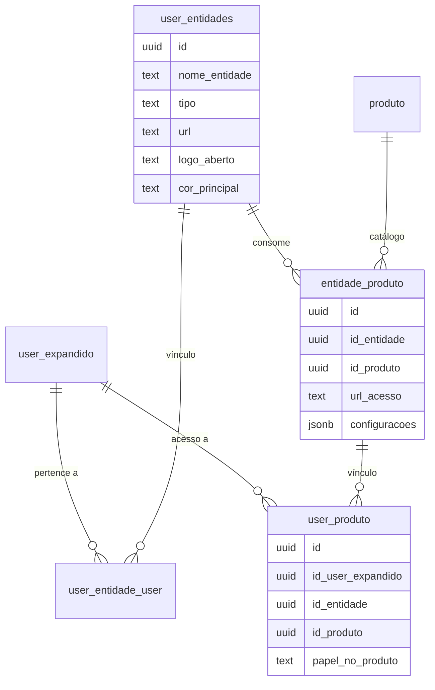

# Documentação de Arquitetura - Educlick Minimal

Esta documentação descreve as mudanças arquiteturais realizadas para suportar um sistema multi-produto, multi-entidade e a unificação da gestão de sessões.

## 1. Modelo de Entidades e Produtos

O sistema evoluiu de um modelo focado em `Empresa` para um modelo baseado em `Entidades`. Agora, uma **Entidade** (Empresa ou Família) pode estar vinculada a múltiplos **Produtos** (Acadêmico, Financeiro, etc.).

### Diagrama de Relacionamentos (ER)



### Principais Mudanças:
- **Unificação**: A tabela `public.empresa` foi integrada à `public.user_entidades`.
- **Refactoring**: Todas as tabelas acadêmicas (`aca_*`) agora utilizam `id_entidade` como chave estrangeira principal.
- **Roteamento por URL**: A tabela `entidade_produto` armazena a `url_acesso`, permitindo que URLs diferentes levem a contextos diferentes de Produto + Entidade.

---

## 2. Gestão de Sessão (BFF)

A sessão do usuário no front-end (Nuxt) foi sofisticada para carregar toda a hierarquia de acesso em uma única chamada.

### RPC: `nxt_get_user_session_v1`
Consolida os dados do usuário e suas permissões.
- **Entrada**: `p_auth_id` (UUID do Supabase Auth).
- **Retorno (JSON)**:
  ```json
  {
    "usuario": { "id": "...", "nome_completo": "...", "email": "..." },
    "entidades": [
      {
        "id": "...",
        "nome_entidade": "...",
        "branding": { "logo": "...", "cores": "..." },
        "produtos": [
          { "slug": "academico", "url_acesso": "..." }
        ]
      }
    ]
  }
```

### Endpoint: `/api/me`
O BFF consome o RPC acima e disponibiliza o contexto completo para a `AppStore`.

---

## 3. Módulo Acadêmico (Componentes)

Foram implementados os primeiros CRUDs utilizando o padrão de RPCs com retorno JSONB.

- **RPCs**:
    - `aca_upsert_componente`: Cadastro e edição de matérias.
    - `aca_get_componentes_paginado`: Listagem com busca (`unaccent`), ordenação e paginação.
    - `aca_delete_componente`: Exclusão lógica/segura por entidade.

---

## 4. Como Adicionar um Novo Produto
1. Cadastrar o produto na tabela `public.produto`.
2. Vincular uma entidade ao produto via `public.entidade_produto`, definindo a `url_acesso`.
3. O RPC `aca_get_contexto_por_url` resolverá automaticamente o contexto ao carregar o app.
