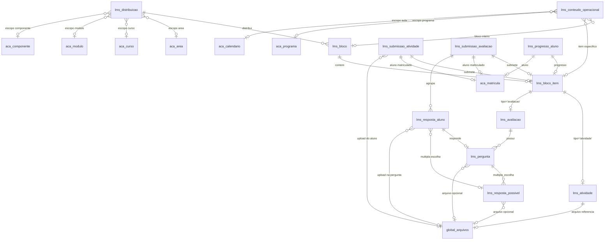

## ***O QUE JÁ TEMOS
## Gerenciamento de Cursos

A arquitetura funciona dividindo o sistema em duas grandes macro-camadas: a **Conceitual (Blueprint)** e a **Operacional (Oferta)**. Na camada conceitual, os _Componentes_ (matérias brutas) alimentam os _Módulos_ (grupos de disciplinas com carga horária), que por sua vez são empacotados na tabela _Cursos_, funcionando como o gabarito pedagógico e definitivo do que a instituição vende. Quando o usuário seleciona um _Curso_, o sistema utiliza esse molde para instanciar a camada operacional através dos _Ciclos_, que são a manifestação física e temporal de cada módulo (com dias e horários definidos).

A tabela **Programas** consolida toda essa operação e centraliza a oferta em todas as suas dimensões, agindo como o container definitivo de uma turma ou período letivo. Além de reunir os _Ciclos_, o _Programa_ serve como o ponto de ancoragem para as regras de negócio: é nele que você vincula múltiplos processos seletivos, diferentes janelas/expedientes de matrícula e variados produtos financeiros para um mesmo bloco de alunos. Essa separação garante reaproveitamento total de conteúdo, permitindo que você mude as estratégias de venda e captação sem precisar duplicar ou engessar a estrutura pedagógica subjacente.

### A Solução: De Estruturas Rígidas para Blocos de Construção

Minha proposta é uma evolução na inteligência do sistema. Em vez de engessarmos o sistema com "tipos de cursos" fixos, vamos implementar uma **Arquitetura Atômica**. O ecossistema passará a trabalhar com seis níveis independentes que se combinam de ponta a ponta:

1. **Área/Modalidade (O Escopo Macro):** A camada mais alta que engloba as grandes verticais de ensino da instituição, como _Cursos Livres_, _Cursos Técnicos_, _Graduação_ ou _Pós-Graduação_. Ela define as regras de negócio gerais de cada segmento.
    
2. **Componente (A Matéria-Prima):** O nível mais granular do conhecimento. São os tópicos específicos e disciplinas isoladas (ex: _Roteiro_, _Fotografia_, _Álgebra Linear_) que servem de base para abastecer as estruturas maiores.
    
3. **Módulo (A Unidade):** Onde agrupamos os componentes para definir o conteúdo acadêmico, a ementa integrada e a carga horária total (ex: "Cinema e Audiovisual" ou "Matemática Financeira").
    
4. **Curso (A Trilha):** A organização lógica e o encadeamento desses módulos. Um curso pode ser uma trilha longa (como um técnico completo) ou um combo rápido de dois módulos de curta duração.
    
5. **Ciclo (A Execução):** É o módulo ou o curso ganhando vida no tempo. É a instância real da sala de aula, definindo _onde_, _quando_, os dias da semana e com qual professor ele vai rodar.
    
6. **Programa (A Oferta):** O pacote comercial e de matrículas. É aqui que decidimos a precificação, as condições de pagamento e quais ciclos específicos compõem aquela oferta disponível para o aluno se inscrever.


## *O QUE VAMOS FAZER

## # LMS

# Pipeline de Conteúdo LMS: Blueprint vs. Operação

O diferencial competitivo deste LMS reside no desacoplamento total entre o planejamento pedagógico perene e a execução comercial. Enquanto os sistemas tradicionais engessam os materiais dentro de "turmas" rígidas — obrigando o professor a duplicar arquivos e refazer o trabalho a cada novo semestre —, esta arquitetura divide o fluxo de criação em duas macro-camadas: a **Conceitual (Blueprint)** e a **Operacional (Oferta)**. O arquivo físico (hospedado de forma econômica no Bunny.net) permanece único, enquanto uma tabela pivô de roteamento lógico se encarrega de distribuir o acesso em milissegundos.

O pipeline inverte a lógica de mercado ao oferecer duas portas de entrada perfeitamente reguladas para a criação de conteúdo:

### 1. A Camada Conceitual (O Blueprint via "Distribuição")

É o design de produto da escola, focado em padronização e escala. Através da aba **Distribuição**, a coordenação alimenta a inteligência imutável da instituição, associando os blocos de conteúdo criados no **Repositório** aos níveis estruturais do Blueprint:

- **Por Área:** Conteúdos macros e transversais liberados para qualquer aluno que pertença àquela grande área de conhecimento (ex: o Hub de Audiovisual).
    
- **Por Curso:** O gabarito definitivo e a fôrma pedagógica do que a instituição vende. Toda e qualquer oferta herdará esses materiais automaticamente.
    
- **Por Módulo:** Blocos de disciplinas agrupados por carga horária.
    
- **Por Componente:** A matéria bruta (ex: _Fotografia 1_). O conteúdo fica colado à disciplina; onde quer que ela apareça, o material estará disponível.
    

### 2. A Camada Operacional (A Oferta via "Currículo")

É a execução viva, dinâmica e temporal do sistema. Através da aba **Currículo**, o professor assume o controle fino da oferta comercial ativa (o **Programa**, que consolida o container definitivo do período letivo, finanças e matrículas, operacionalizado pelos **Ciclos**). No Currículo, a rigidez do Blueprint desaparece para dar lugar à flexibilidade de rotina:

- **Gerenciamento da Herança:** O professor visualiza tudo o que veio mapeado do Blueprint (Área, Curso, Módulo ou Componente) e tem autonomia para ativar ou desativar tópicos com um clique (via _toggle_ de status), adaptando a ementa ao ritmo real dos alunos sem alterar a fôrma original.
    
- **Injeção Operacional Viva:** É o espaço para adicionar conteúdos que só fazem sentido no contexto daquela oferta e que morrem com ela, como links de transmissões ao vivo, gravações de mentorias da semana ou materiais complementares de última hora atrelados ao Ciclo, ao Programa ou a uma Aula específica do cronograma.
    

Para o aluno, o front-end em Nuxt consome essa engenharia de forma transparente. Ao acessar o seu **Programa**, o sistema resolve a árvore de herança e entrega uma interface limpa onde o estudante escolhe se quer consumir o conteúdo de forma linear (na linha do tempo da operação) ou de forma temática (navegando pelos componentes do Blueprint), contando com indicadores de leitura unificados. O resultado é um LMS com custo de manutenção zero para novas turmas, segurança via RLS por tenant e altíssimo valor agregado.

### O Funil de Resolução de Conteúdos

Quando o aluno acessa o portal a partir do seu **Programa** (turma ativa), o motor do banco de dados (PostgreSQL) consolida e exibe os materiais do macro para o micro através de IDs indexados:

1. **Escopo Global (Institucional):** Manuais da escola e informes financeiros atrelados estritamente ao identificador da instituição (`id_empresa`).
    
2. **Escopo do Curso (A Fôrma):** Materiais teóricos perenes, e-books e bases de pesquisa vinculados ao `id_curso`. Toda nova turma herda isso automaticamente.
    
3. **Escopo do Componente (Pedagógico):** Blocos de conteúdo vinculados diretamente à disciplina (`id_componente`), independente de qual turma está consumindo.
    
4. **Escopo do Programa (A Iteração Viva):** Materiais exclusivos da jornada daquela turma (links de transmissões ao vivo, gravações de mentorias). Nascem limpos a cada nova oferta comercial.
    
5. **Escopo de Aula (O Cronograma):** Materiais travados cirurgicamente no ID de um dia específico do calendário de aulas.
    
6. **Escopo de Aluno (Exclusivo):** Conteúdos ou revisões direcionados individualmente para um único `id_aluno`.
    

## 3. Fluxo de Trabalho na Interface (UX do Painel de Gestão)

Para simplificar a rotina dos professores e coordenadores, o front-end do LMS organiza-se em três abas funcionais:

### 📁 1. Repositório

O "drive" pedagógico isolado. É o espaço onde os professores fazem o _upload_ bruto dos materiais e estruturam os **Blocos** de conteúdo (containers de tópicos com seus respectivos arquivos e questionários de múltipla escolha ou dissertativos). O conteúdo é salvo de forma livre, sem vínculos temporais.

### 🔄 2. Distribuição

A central de inteligência e mapeamento. Tela em formato de painel dinâmico onde o coordenador seleciona blocos criados no _Repositório_ e os associa em massa para a estrutura fixa da escola (vinculando-os diretamente a um _Componente Geral_ ou à base imutável de um _Curso_).

### 🏫 3. Currículo

A visão de planejamento prático das turmas. O usuário seleciona o **Programa** ativo e gerencia exatamente o que a turma está consumindo. Permite visualizar os blocos herdados do curso, os materiais organizados por componente da turma e o cronograma linear de aulas. Possui um atalho contextual para que o professor crie conteúdos dinâmicos (como links de ao vivo e gravações) diretamente na gaveta de uma aula específica, injetando os metadados automaticamente no banco [cite: 2025-12-04].


---

## 4. Modelagem do Banco de Dados

### Diagrama de Entidades e Relacionamentos



### Script de Migração SQL

```sql
-- ============================================================
-- Migration: LMS — Learning Management System
-- Descrição: Tabelas para o pipeline de conteúdo
--            Repositório → Distribuição → Currículo
-- Padrão:   SECURITY INVOKER, RLS por entidade (id_entidade),
--            FK para user_entidades e user_expandido
-- ============================================================

-- Extensão para geração de UUIDs
CREATE EXTENSION IF NOT EXISTS "uuid-ossp";

-- ============================================================
-- Tipos ENUM
-- ============================================================
DO $$ BEGIN
    CREATE TYPE lms_tipo_item AS ENUM ('material', 'atividade', 'avaliacao');
EXCEPTION WHEN duplicate_object THEN NULL;
END $$;

DO $$ BEGIN
    CREATE TYPE lms_tipo_pergunta AS ENUM ('dissertativa', 'multipla_escolha');
EXCEPTION WHEN duplicate_object THEN NULL;
END $$;

DO $$ BEGIN
    CREATE TYPE lms_status_submissao AS ENUM ('em_andamento', 'entregue', 'corrigido');
EXCEPTION WHEN duplicate_object THEN NULL;
END $$;

DO $$ BEGIN
    CREATE TYPE lms_tipo_submissao_atv AS ENUM ('texto', 'arquivo', 'texto_e_arquivo');
EXCEPTION WHEN duplicate_object THEN NULL;
END $$;

-- ============================================================
-- 1. lms_bloco — Bloco de Conteúdo (a "pasta" do Repositório)
-- ============================================================
CREATE TABLE IF NOT EXISTS public.lms_bloco (
    id              UUID PRIMARY KEY DEFAULT gen_random_uuid(),
    id_entidade     UUID NOT NULL REFERENCES public.user_entidades(id) ON DELETE CASCADE,
    titulo          TEXT NOT NULL,
    descricao       TEXT,
    cor_ident       TEXT,
    ativo           BOOLEAN DEFAULT TRUE,
    criado_por      UUID REFERENCES public.user_expandido(id),
    criado_em       TIMESTAMPTZ DEFAULT NOW(),
    modificado_por  UUID REFERENCES public.user_expandido(id),
    modificado_em   TIMESTAMPTZ DEFAULT NOW()
);

-- ============================================================
-- 2. lms_bloco_item — Item dentro de um Bloco
--    Ponto central do pipeline: define a disponibilidade e o
--    tipo (material = exibição, atividade = submissão,
--    avaliacao = perguntas + respostas).
-- ============================================================
CREATE TABLE IF NOT EXISTS public.lms_bloco_item (
    id                    UUID PRIMARY KEY DEFAULT gen_random_uuid(),
    id_bloco              UUID NOT NULL REFERENCES public.lms_bloco(id) ON DELETE CASCADE,
    tipo                  lms_tipo_item NOT NULL,
    titulo                TEXT NOT NULL,
    descricao             TEXT,
    ordem                 INTEGER DEFAULT 0,

    -- Controle de disponibilidade (timing)
    data_disponivel         TIMESTAMPTZ,
    data_entrega_limite     TIMESTAMPTZ,
    duracao_minutos         INTEGER,
    tentativas_permitidas   INTEGER DEFAULT 1,
    pontuacao_maxima        NUMERIC(6,2),

    ativo           BOOLEAN DEFAULT TRUE,
    criado_por      UUID REFERENCES public.user_expandido(id),
    criado_em       TIMESTAMPTZ DEFAULT NOW(),
    modificado_por  UUID REFERENCES public.user_expandido(id),
    modificado_em   TIMESTAMPTZ DEFAULT NOW()
);

-- ============================================================
-- 3. lms_atividade — Atividade com Arquivo de Referência
--    "O aluno pode fazer atividade de responder ou de upload"
--    Ligada 1:1 a lms_bloco_item (tipo = 'atividade').
-- ============================================================
CREATE TABLE IF NOT EXISTS public.lms_atividade (
    id                      UUID PRIMARY KEY DEFAULT gen_random_uuid(),
    id_bloco_item           UUID NOT NULL REFERENCES public.lms_bloco_item(id) ON DELETE CASCADE UNIQUE,

    -- Arquivo de referência (ex: enunciado, modelo para download)
    id_arquivo_referencia   UUID REFERENCES public.global_arquivos(id) ON DELETE SET NULL,

    -- Configuração do tipo de submissão esperada do aluno
    tipo_submissao          lms_tipo_submissao_atv NOT NULL DEFAULT 'texto',

    criado_em       TIMESTAMPTZ DEFAULT NOW(),
    modificado_em   TIMESTAMPTZ DEFAULT NOW()
);

-- ============================================================
-- 4. lms_avaliacao — Avaliação (Questionário / Prova)
--    Ligada 1:1 a lms_bloco_item (tipo = 'avaliacao').
--    Contém N perguntas (dissertativas ou múltipla escolha).
-- ============================================================
CREATE TABLE IF NOT EXISTS public.lms_avaliacao (
    id                  UUID PRIMARY KEY DEFAULT gen_random_uuid(),
    id_bloco_item       UUID NOT NULL REFERENCES public.lms_bloco_item(id) ON DELETE CASCADE UNIQUE,
    nome                TEXT NOT NULL,
    descricao           TEXT,
    ordem_perguntas     TEXT DEFAULT 'fixa' CHECK (ordem_perguntas IN ('fixa', 'aleatoria')),
    criado_em           TIMESTAMPTZ DEFAULT NOW(),
    modificado_em       TIMESTAMPTZ DEFAULT NOW()
);

-- ============================================================
-- 5. lms_pergunta — Pergunta (Dissertativa ou Múltipla Escolha)
--    Pode conter arquivo de suporte (ex: imagem).
-- ============================================================
CREATE TABLE IF NOT EXISTS public.lms_pergunta (
    id                UUID PRIMARY KEY DEFAULT gen_random_uuid(),
    id_avaliacao      UUID NOT NULL REFERENCES public.lms_avaliacao(id) ON DELETE CASCADE,
    tipo              lms_tipo_pergunta NOT NULL,
    enunciado         TEXT NOT NULL,
    pontuacao         NUMERIC(6,2) DEFAULT 0 NOT NULL,
    obrigatoria       BOOLEAN DEFAULT TRUE,
    ordem             INTEGER DEFAULT 0,
    id_arquivo        UUID REFERENCES public.global_arquivos(id) ON DELETE SET NULL,
    criado_em         TIMESTAMPTZ DEFAULT NOW(),
    modificado_em     TIMESTAMPTZ DEFAULT NOW()
);

-- ============================================================
-- 6. lms_resposta_possivel — Alternativas (Múltipla Escolha)
--    Cada alternativa pode ter um arquivo (imagem, áudio, etc.).
-- ============================================================
CREATE TABLE IF NOT EXISTS public.lms_resposta_possivel (
    id              UUID PRIMARY KEY DEFAULT gen_random_uuid(),
    id_pergunta     UUID NOT NULL REFERENCES public.lms_pergunta(id) ON DELETE CASCADE,
    texto           TEXT NOT NULL,
    correta         BOOLEAN DEFAULT FALSE,
    ordem           INTEGER DEFAULT 0,
    id_arquivo      UUID REFERENCES public.global_arquivos(id) ON DELETE SET NULL,
    criado_em       TIMESTAMPTZ DEFAULT NOW()
);

-- ============================================================
-- 7. lms_submissao_atividade — Submissão do Aluno (Atividade)
--    "O aluno pode enviar texto, arquivo, ou ambos."
--    Suporta múltiplas tentativas com UNIQUE composto.
-- ============================================================
CREATE TABLE IF NOT EXISTS public.lms_submissao_atividade (
    id                  UUID PRIMARY KEY DEFAULT gen_random_uuid(),
    id_entidade         UUID NOT NULL REFERENCES public.user_entidades(id) ON DELETE CASCADE,
    id_bloco_item       UUID NOT NULL REFERENCES public.lms_bloco_item(id) ON DELETE CASCADE,
    id_matricula        UUID NOT NULL REFERENCES public.aca_matricula(id) ON DELETE CASCADE,
    texto_resposta      TEXT,
    id_arquivo_envio    UUID REFERENCES public.global_arquivos(id) ON DELETE SET NULL,
    data_inicio         TIMESTAMPTZ,
    data_envio          TIMESTAMPTZ DEFAULT NOW(),
    tentativa           INTEGER DEFAULT 1,
    status              lms_status_submissao DEFAULT 'em_andamento',
    nota                NUMERIC(6,2),
    comentario_professor TEXT,
    criado_em           TIMESTAMPTZ DEFAULT NOW(),
    modificado_em       TIMESTAMPTZ DEFAULT NOW(),
    UNIQUE (id_bloco_item, id_matricula, tentativa)
);

-- ============================================================
-- 8. lms_submissao_avaliacao — Submissão de Avaliação
--    Agrupa todas as respostas do aluno a uma avaliação.
-- ============================================================
CREATE TABLE IF NOT EXISTS public.lms_submissao_avaliacao (
    id                  UUID PRIMARY KEY DEFAULT gen_random_uuid(),
    id_entidade         UUID NOT NULL REFERENCES public.user_entidades(id) ON DELETE CASCADE,
    id_bloco_item       UUID NOT NULL REFERENCES public.lms_bloco_item(id) ON DELETE CASCADE,
    id_matricula        UUID NOT NULL REFERENCES public.aca_matricula(id) ON DELETE CASCADE,
    tentativa           INTEGER DEFAULT 1,
    data_inicio         TIMESTAMPTZ,
    data_entrega        TIMESTAMPTZ,
    status              lms_status_submissao DEFAULT 'em_andamento',
    nota_total          NUMERIC(6,2),
    criado_em           TIMESTAMPTZ DEFAULT NOW(),
    modificado_em       TIMESTAMPTZ DEFAULT NOW(),
    UNIQUE (id_bloco_item, id_matricula, tentativa)
);

-- ============================================================
-- ANOTAÇÃO IMPORTANTE — RPC de Insert (Submissão de Avaliação)
--
-- A UNIQUE (id_bloco_item, id_matricula, tentativa) controla as
-- tentativas permitidas. A RPC de insert deve:
--
--   1. Verificar quantas tentativas o aluno já usou
--      (COUNT WHERE id_bloco_item = X AND id_matricula = Y).
--
--   2. Se tentativas_permitidas (em lms_bloco_item) foi atingido,
--      retornar erro.
--
--   3. Caso contrário, INSERT com:
--        - data_inicio = NOW()
--        - tentativa  = COUNT atual + 1
--        - status     = 'em_andamento'
--
--   4. Se o aluno tentar abrir outra aba (duplo clique / nova guia),
--      o próprio UNIQUE no banco trava: a segunda tentativa com
--      mesmo número gera erro de duplicidade. O front-end trata
--      o erro e redireciona para a submissão existente.
--
--   5. Para submissões 'em_andamento' com data_inicio muito antiga
--      (ex: > duracao_minutos), a RPC pode considerar expirada e
--      forçar nova tentativa ou bloquear.
-- ============================================================

-- ============================================================
-- 9. lms_resposta_aluno — Resposta do Aluno a uma Pergunta
--    Ligada a lms_submissao_avaliacao.
--    Suporta: resposta textual, id de resposta possível (ME),
--    ou upload de arquivo (ex: anexo na dissertativa).
-- ============================================================
CREATE TABLE IF NOT EXISTS public.lms_resposta_aluno (
    id                      UUID PRIMARY KEY DEFAULT gen_random_uuid(),
    id_submissao_avaliacao  UUID NOT NULL REFERENCES public.lms_submissao_avaliacao(id) ON DELETE CASCADE,
    id_pergunta             UUID NOT NULL REFERENCES public.lms_pergunta(id) ON DELETE CASCADE,
    id_resposta_possivel    UUID REFERENCES public.lms_resposta_possivel(id) ON DELETE SET NULL,
    texto_resposta          TEXT,
    id_arquivo_envio        UUID REFERENCES public.global_arquivos(id) ON DELETE SET NULL,
    criado_em               TIMESTAMPTZ DEFAULT NOW(),
    modificado_em           TIMESTAMPTZ DEFAULT NOW(),
    UNIQUE (id_submissao_avaliacao, id_pergunta)
);

-- ============================================================
-- 10. lms_distribuicao — Mapeamento Bloco → Blueprint
--     Camada Conceitual: associa blocos à estrutura perene
--     (Área, Curso, Módulo ou Componente).
--     A CHECK约束 garante exatamente um escopo preenchido.
-- ============================================================
CREATE TABLE IF NOT EXISTS public.lms_distribuicao (
    id              UUID PRIMARY KEY DEFAULT gen_random_uuid(),
    id_entidade     UUID NOT NULL REFERENCES public.user_entidades(id) ON DELETE CASCADE,
    id_bloco        UUID NOT NULL REFERENCES public.lms_bloco(id) ON DELETE CASCADE,
    id_area         UUID REFERENCES public.aca_area(id) ON DELETE CASCADE,
    id_curso        UUID REFERENCES public.aca_curso(id) ON DELETE CASCADE,
    id_modulo       UUID REFERENCES public.aca_modulo(id) ON DELETE CASCADE,
    id_componente   UUID REFERENCES public.aca_componente(id) ON DELETE CASCADE,
    ativo           BOOLEAN DEFAULT TRUE,
    criado_por      UUID REFERENCES public.user_expandido(id),
    criado_em       TIMESTAMPTZ DEFAULT NOW(),
    CONSTRAINT lms_distribuicao_um_escopo CHECK (
        (id_area IS NOT NULL)::INT +
        (id_curso IS NOT NULL)::INT +
        (id_modulo IS NOT NULL)::INT +
        (id_componente IS NOT NULL)::INT = 1
    )
);

-- Índices para busca rápida por escopo na distribuição
CREATE INDEX IF NOT EXISTS idx_lms_distribuicao_area ON public.lms_distribuicao(id_area);
CREATE INDEX IF NOT EXISTS idx_lms_distribuicao_curso ON public.lms_distribuicao(id_curso);
CREATE INDEX IF NOT EXISTS idx_lms_distribuicao_modulo ON public.lms_distribuicao(id_modulo);
CREATE INDEX IF NOT EXISTS idx_lms_distribuicao_componente ON public.lms_distribuicao(id_componente);
CREATE INDEX IF NOT EXISTS idx_lms_distribuicao_bloco ON public.lms_distribuicao(id_bloco);

-- ============================================================
-- 11. lms_conteudo_operacional — Currículo Vivo
--     Duas portas de entrada:
--       Cenário A: id_bloco preenchido → ativa o Bloco inteiro no Programa
--       Cenário B: id_bloco_item preenchido → item específico em uma Aula
--     A CHECK exige que exatamente uma das duas portas seja usada.
-- ============================================================
CREATE TABLE IF NOT EXISTS public.lms_conteudo_operacional (
    id                      UUID PRIMARY KEY DEFAULT gen_random_uuid(),
    id_entidade             UUID NOT NULL REFERENCES public.user_entidades(id) ON DELETE CASCADE,

    -- Duas portas de entrada da operação (ambas nullable, mas uma deve estar preenchida)
    id_bloco                UUID REFERENCES public.lms_bloco(id) ON DELETE CASCADE,
    id_bloco_item           UUID REFERENCES public.lms_bloco_item(id) ON DELETE CASCADE,

    -- Onde isso está sendo aplicado
    id_programa             UUID REFERENCES public.aca_programa(id) ON DELETE CASCADE,
    id_calendario           UUID REFERENCES public.aca_calendario(id) ON DELETE CASCADE,

    id_distribuicao_origem  UUID REFERENCES public.lms_distribuicao(id) ON DELETE SET NULL,
    ativo                   BOOLEAN DEFAULT TRUE,
    criado_por              UUID REFERENCES public.user_expandido(id),
    criado_em               TIMESTAMPTZ DEFAULT NOW(),

    -- GARANTE: Ou vincula o Bloco inteiro, ou vincula um Item específico
    CONSTRAINT lms_operacional_alvo_check CHECK (
        (id_bloco IS NOT NULL AND id_bloco_item IS NULL) OR
        (id_bloco_item IS NOT NULL AND id_bloco IS NULL)
    ),

    -- GARANTE: Vincula ou ao Programa Geral ou a uma Aula (Calendário) específica
    CONSTRAINT lms_conteudo_operacional_um_escopo CHECK (
        (id_programa IS NOT NULL)::INT +
        (id_calendario IS NOT NULL)::INT = 1
    )
);

-- Índices parciais para cobrir os dois cenários de busca
CREATE INDEX IF NOT EXISTS idx_lms_conteudo_op_bloco ON public.lms_conteudo_operacional(id_bloco) WHERE id_bloco IS NOT NULL;
CREATE INDEX IF NOT EXISTS idx_lms_conteudo_op_item ON public.lms_conteudo_operacional(id_bloco_item) WHERE id_bloco_item IS NOT NULL;
CREATE INDEX IF NOT EXISTS idx_lms_conteudo_op_programa ON public.lms_conteudo_operacional(id_programa);
CREATE INDEX IF NOT EXISTS idx_lms_conteudo_op_calendario ON public.lms_conteudo_operacional(id_calendario);

-- ============================================================
-- 12. lms_progresso_aluno — Progresso do Aluno
--     Marca itens como concluídos/vistos pelo aluno.
-- ============================================================
CREATE TABLE IF NOT EXISTS public.lms_progresso_aluno (
    id              UUID PRIMARY KEY DEFAULT gen_random_uuid(),
    id_entidade     UUID NOT NULL REFERENCES public.user_entidades(id) ON DELETE CASCADE,
    id_bloco_item   UUID NOT NULL REFERENCES public.lms_bloco_item(id) ON DELETE CASCADE,
    id_matricula    UUID NOT NULL REFERENCES public.aca_matricula(id) ON DELETE CASCADE,
    concluido       BOOLEAN DEFAULT FALSE,
    visto_em        TIMESTAMPTZ,
    criado_em       TIMESTAMPTZ DEFAULT NOW(),
    modificado_em   TIMESTAMPTZ DEFAULT NOW(),
    UNIQUE (id_bloco_item, id_matricula)
);

-- ============================================================
-- Índices adicionais para performance
-- ============================================================
CREATE INDEX IF NOT EXISTS idx_lms_bloco_entidade ON public.lms_bloco(id_entidade);
CREATE INDEX IF NOT EXISTS idx_lms_bloco_item_bloco ON public.lms_bloco_item(id_bloco);
CREATE INDEX IF NOT EXISTS idx_lms_submissao_atv_entidade ON public.lms_submissao_atividade(id_entidade);
CREATE INDEX IF NOT EXISTS idx_lms_submissao_atv_matricula ON public.lms_submissao_atividade(id_matricula);
CREATE INDEX IF NOT EXISTS idx_lms_submissao_av_entidade ON public.lms_submissao_avaliacao(id_entidade);
CREATE INDEX IF NOT EXISTS idx_lms_submissao_av_matricula ON public.lms_submissao_avaliacao(id_matricula);
CREATE INDEX IF NOT EXISTS idx_lms_progresso_entidade ON public.lms_progresso_aluno(id_entidade);
CREATE INDEX IF NOT EXISTS idx_lms_progresso_matricula ON public.lms_progresso_aluno(id_matricula);

-- ============================================================
-- RLS — Row Level Security
-- Mesmo padrão das demais tabelas do sistema:
--   - Admin da entidade tem acesso total
--   - Usuários da entidade (via JWT -> entidades) têm acesso
--   - Professor vê apenas o que criou
--   - Aluno vê apenas conteúdos disponíveis + suas submissões
-- ============================================================

-- Helper function: verifica se o usuário pertence à entidade
-- (reutilizada das policies existentes)
-- CREATE OR REPLACE FUNCTION public.aca_usuario_pertence_entidade(p_id_entidade UUID)
-- RETURNS BOOLEAN
-- LANGUAGE sql
-- SECURITY DEFINER
-- AS $$
--   SELECT EXISTS (
--     SELECT 1 FROM jsonb_array_elements_text(auth.jwt() -> 'entidades') e(ent)
--     WHERE e.ent::uuid = p_id_entidade
--   );
-- $$;

-- Políticas simplificadas para lms_bloco (exemplo do padrão a ser replicado)

ALTER TABLE public.lms_bloco ENABLE ROW LEVEL SECURITY;
ALTER TABLE public.lms_bloco_item ENABLE ROW LEVEL SECURITY;
ALTER TABLE public.lms_atividade ENABLE ROW LEVEL SECURITY;
ALTER TABLE public.lms_avaliacao ENABLE ROW LEVEL SECURITY;
ALTER TABLE public.lms_pergunta ENABLE ROW LEVEL SECURITY;
ALTER TABLE public.lms_resposta_possivel ENABLE ROW LEVEL SECURITY;
ALTER TABLE public.lms_submissao_atividade ENABLE ROW LEVEL SECURITY;
ALTER TABLE public.lms_submissao_avaliacao ENABLE ROW LEVEL SECURITY;
ALTER TABLE public.lms_resposta_aluno ENABLE ROW LEVEL SECURITY;
ALTER TABLE public.lms_distribuicao ENABLE ROW LEVEL SECURITY;
ALTER TABLE public.lms_conteudo_operacional ENABLE ROW LEVEL SECURITY;
ALTER TABLE public.lms_progresso_aluno ENABLE ROW LEVEL SECURITY;

-- Nota: As policies específicas serão criadas em migrations separadas,
-- seguindo o mesmo padrão das tabelas aca_* existentes no projeto.
-- O RLS é ativado aqui por completeza, mas as regras de fato
-- (SELECT/INSERT/UPDATE/DELETE por papel) devem seguir o modelo
-- consolidado do sistema.
