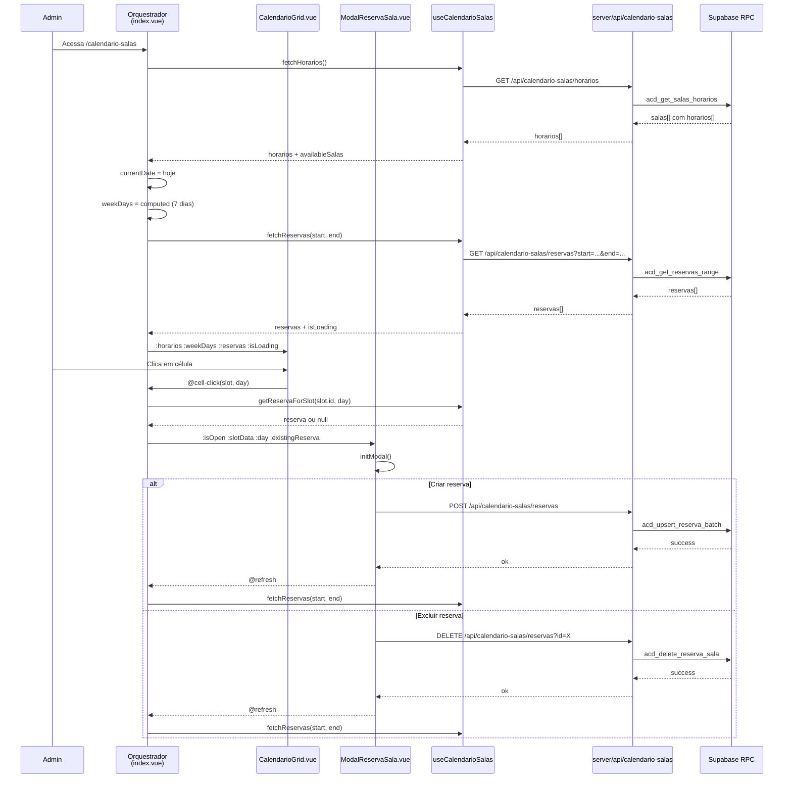

# Plano — Calendário de Salas (`/calendario-salas`)

## Visão Geral

Página **administrativa** para gestão da ocupação de salas, exibindo um grid semanal com slots de horário por sala, destacando reservas existentes (aulas ou eventos) e permitindo criar, editar e excluir reservas.

**Inspiração direta no projeto SPED** (`calendario-salas`) — mesma mecânica de grid semanal com salas × horários × dias, adaptada ao domínio acadêmico do EduClick.

---

## Funcionalidades

### Estrutura da Página

```
┌──────────────────────────────────────────────────────────────────────┐
│  Calendário de Salas                                                 │
├──────────────────────────────────────────────────────────────────────┤
│  [Sala: Todas as Salas ▼]  | [📅 13/07/2026]  [⬅ Hoje ➡]           │ ← Header
├──────────────────────────────────────────────────────────────────────┤
│  Sala / Horário  │  Seg 14/07  │  Ter 15/07  │  ...  │  Dom 20/07  │ ← Grid
│ ─────────────────┼─────────────┼─────────────┼───────┼─────────────┤
│  Sala 101        │             │             │       │             │
│  07:30 - 08:20   │  [Aula: Mat]│  [Evento:   │       │             │
│                  │   Prof:?    │   Palestra] │       │             │
│ ─────────────────┼─────────────┼─────────────┼───────┼─────────────┤
│  Sala 101        │             │             │       │             │
│  08:20 - 09:10   │             │             │       │             │
│ ─────────────────┼─────────────┼─────────────┼───────┼─────────────┤
│  ...             │    ...      │    ...      │  ...  │    ...      │
└──────────────────────────────────────────────────────────────────────┘
```

### Fluxo de Navegação

| Ação | Comportamento |
|---|---|
| **Navegação semanal** | Botões "Anterior" / "Hoje" / "Próxima" alteram a semana |
| **Filtro por sala** | Dropdown com "Todas as Salas" + cada sala disponível |
| **Clique em célula vazia** | Abre modal p/ criar reserva (evento ou vincular aula) |
| **Clique em célula ocupada** | Abre modal p/ editar ou excluir reserva existente |
| **Hover sobre reserva** | Tooltip com detalhes (tipo, nome, observações) |

### Ações no Modal de Reserva

#### Criar/Editar Reserva
- **Tipo**: `aula` (vinculada a uma aula do calendário acadêmico) ou `evento` (nome livre)
- **Escopo**: `horário` (slot único), `período` (turno inteiro), `dia` (todos horários da sala)
- **Detecção de conflito**: impede dupla reserva no mesmo slot (com exceção da própria reserva em edição)
- **Observações**: campo texto livre

#### Excluir Reserva
- Confirmação inline no modal
- DELETE no BFF → refresh do grid

---

## Pipeline de Dados

```
Orquestrador → Componente → Composable → BFF → RPC → Banco
```

```
app/pages/calendario-salas/index.vue             ← orquestrador (~80 linhas)
app/components/calendario-salas/
├── CalendarioGrid.vue                            ← grid semanal (salas × dias)
└── ModalReservaSala.vue                          ← criar/editar/excluir reserva

app/components/global/
├── BaseSelect.vue                                ← select padronizado (CRIAR)
└── ModalConfirmacao.vue                          ← já existe, reutilizar

app/composables/calendario-salas/
└── useCalendarioSalas.ts                         ← fetch horarios + reservas + helpers

server/api/calendario-salas/
├── horarios.get.ts                               ← GET grade de salas + horários
├── reservas.get.ts                               ← GET reservas por range de data
├── reservas.post.ts                              ← POST criar/atualizar reservas (batch)
└── reservas.delete.ts                            ← DELETE reserva

server/api/academico_oferta/
└── turmas-calendario.get.ts                      ← GET turmas para dropdown (ou reuso)
```

---

## Banco de Dados — Estrutura Proposta

### 1. `acd_sala` — Salas físicas

```sql
CREATE TABLE public.acd_sala (
    id UUID PRIMARY KEY DEFAULT gen_random_uuid(),
    id_entidade UUID NOT NULL REFERENCES public.user_entidades(id) ON DELETE CASCADE,
    nome TEXT NOT NULL,
    capacidade INTEGER,
    cor TEXT NOT NULL DEFAULT '#8b5cf6',      -- cor para identificar no grid
    ativo BOOLEAN NOT NULL DEFAULT true,
    criado_em TIMESTAMPTZ DEFAULT NOW(),
    UNIQUE(id_entidade, nome)
);
```

### 2. `acd_sala_horario` — Grade de horários (slots)

```sql
CREATE TABLE public.acd_sala_horario (
    id UUID PRIMARY KEY DEFAULT gen_random_uuid(),
    id_entidade UUID NOT NULL REFERENCES public.user_entidades(id) ON DELETE CASCADE,
    id_sala UUID NOT NULL REFERENCES public.acd_sala(id) ON DELETE CASCADE,
    indice INTEGER NOT NULL,                  -- ordem do slot (1..N)
    nome_turno TEXT NOT NULL,                  -- 'Matutino', 'Vespertino', 'Noturno'
    horario_inicio TIME NOT NULL,
    horario_fim TIME NOT NULL,
    ativo BOOLEAN NOT NULL DEFAULT true,
    UNIQUE(id_sala, indice)
);
```

> **Nota:** A grade pode ser gerada automaticamente a partir de turnos/config, ou manual pelo admin.

### 3. `acd_reserva_sala` — Reservas

```sql
CREATE TABLE public.acd_reserva_sala (
    id UUID PRIMARY KEY DEFAULT gen_random_uuid(),
    id_entidade UUID NOT NULL REFERENCES public.user_entidades(id) ON DELETE CASCADE,
    id_sala_horario UUID NOT NULL REFERENCES public.acd_sala_horario(id),
    data DATE NOT NULL,                        -- data da reserva (yyyy-mm-dd)
    tipo TEXT NOT NULL CHECK (tipo IN ('aula', 'evento')),
    status TEXT NOT NULL DEFAULT 'reservado' CHECK (status IN ('reservado', 'cancelado')),
    
    -- Se for aula vinculada ao calendário acadêmico
    id_aula UUID REFERENCES public.aca_programa_aula(id) ON DELETE SET NULL,
    
    -- Se for evento avulso
    evento_nome TEXT,
    
    -- Geral
    observacoes TEXT,
    criado_por UUID REFERENCES public.user_expandido(id),
    criado_em TIMESTAMPTZ DEFAULT NOW(),
    modificado_por UUID REFERENCES public.user_expandido(id),
    modificado_em TIMESTAMPTZ
);

-- Índice para busca por range de data
CREATE INDEX idx_reserva_sala_data ON public.acd_reserva_sala (data);
CREATE INDEX idx_reserva_sala_range ON public.acd_reserva_sala (id_sala_horario, data);
```

### 4. RPCs Necessárias

| RPC | Descrição | Pipeline |
|---|---|---|
| `acd_get_salas_horarios` | Retorna salas + grade de horários | `acd_sala JOIN acd_sala_horario ORDER BY sala.nome, horario.indice` |
| `acd_get_reservas_range` | Reservas em um range de datas | `acd_reserva_sala WHERE data BETWEEN p_inicio AND p_fim` |
| `acd_upsert_reserva_batch` | Criar/atualizar lote de reservas (lida com escopo) | INSERT ON CONFLICT (sala_horario_id, data) DO UPDATE |
| `acd_delete_reserva_sala` | Excluir reserva por ID | DELETE WHERE id = p_id |

---

## Estrutura de Diretórios (Frontend)

```
front_end/app/
├── pages/calendario-salas/
│   └── index.vue                       ← Orquestrador (~80 linhas)
├── components/calendario-salas/
│   ├── CalendarioGrid.vue               ← Grid semanal + tooltip hover
│   └── ModalReservaSala.vue             ← Modal criar/editar/excluir
├── contracts/                           ← (opcional) Tipos compartilhados
│   └── calendario-salas.ts
├── composables/calendario-salas/
│   └── useCalendarioSalas.ts            ← Fetch + helpers

server/api/calendario-salas/
├── horarios.get.ts                      ← GET grade
├── reservas.get.ts                      ← GET por range
├── reservas.post.ts                     ← POST batch upsert
└── reservas.delete.ts                   ← DELETE
```

---

## Diagrama de Fluxo



---

## Componentes vs SPED — Paralelo

| Elemento | SPED (`producao/calendario-salas`) | EduClick (`calendario-salas`) |
|---|---|---|
| Orquestrador | `pages/calendario-salas/index.vue` | `pages/calendario-salas/index.vue` |
| Grid semanal | `CalendarioGrid.vue` | `CalendarioGrid.vue` |
| Modal reserva | `ModalReservaSala.vue` | `ModalReservaSala.vue` |
| Composable | `useCalendarioSalas.ts` | `useCalendarioSalas.ts` |
| BFF horários | `/api/producao/calendario/horarios` | `/api/calendario-salas/horarios` |
| BFF reservas (GET) | `/api/producao/calendario/reservas` | `/api/calendario-salas/reservas` |
| BFF reservas (POST) | `/api/producao/calendario/reservas` | `/api/calendario-salas/reservas` |
| BFF reservas (DELETE) | `/api/producao/calendario/reservas` | `/api/calendario-salas/reservas` |
| BFF turmas | `/api/producao/calendario/turmas` | Reusa BFFs existentes do módulo acadêmico |
| Select padronizado | `BaseSelect.vue` (existente) | **Criar** `components/global/BaseSelect.vue` |
| Fonte de dados | Reservas desconectadas (criadas manualmente) | **Vinculado às aulas do calendário acadêmico** |
| Tipo "aula" | Turma genérica | Aula específica do `academico_calendario` |

---

## Estados da UI

| Estado | Renderização |
|---|---|
| `isLoading` (inicial) | Spinner centralizado |
| `horarios.length === 0` | Empty state + "Nenhuma sala cadastrada" |
| `reservasLoading` | Skeleton no grid |
| `filteredHorarios.length === 0` | "Nenhuma sala para o filtro selecionado" |
| Normal | Grid com células + tooltips |
| Modal aberto | Overlay escuro + painel central |

---

## Contrato Visual Aplicado

(mesmo design system do EduClick — ver `contrato-visual.md`)

- **Layout**: `base` com sidebar (admin autenticado)
- **Header**: título + filtro sala + date picker + navegação semanal
- **Grid**: fundo `#16161E`, bordas `white/5`, sticky headers
- **Células**: hover `bg-white/10`, slot vazio mostra "+" no hover
- **Reservas**: badge com cor da sala + nome da aula/evento
- **Tooltip**: painel `#1A1B26` com borda, tipo + nome + observações
- **Modal**: overlay `rgba(0,0,0,0.85)`, painel `#13131a`, accent bar gradient
- **Select**: `BaseSelect` padronizado (criar componente reutilizável)
- **Scrollbar**: 8px com track `#16161E` e thumb `rgba(255,255,255,0.1)`

---

## Observações e Riscos

1. **Vinculação com aulas existentes**: Diferente do SPED, aqui as reservas do tipo "aula" devem se conectar com as aulas já existentes no `aca_programa_aula` (calendário acadêmico). Isso permite que o calendário de salas reflita a ocupação real.

2. **Estrutura de `aca_programa_aula`**: É necessário verificar se a tabela de aulas já existe e qual sua estrutura atual (campos como `id_sala`, `id_professor`, etc.) para fazer o vínculo correto.

3. **Grade de horários por sala**: Diferente do SPED onde a grade é fixa, aqui podemos ter salas com grades diferentes. A RPC `acd_get_salas_horarios` precisa retornar a grade específica de cada sala.

4. **BaseSelect**: Será criado como componente global reutilizável (`components/global/BaseSelect.vue`), seguindo o padrão escuro do design system, para ser usado aqui e futuramente em outras páginas.

5. **Conflito de reservas**: A detecção de conflito considera escopo (horário/período/dia). A RPC de upsert deve validar conflitos no banco para evitar race conditions.

---

## 🧑‍🏫 Pré-requisito: Gestão de Docentes + Atribuição

> **Observação importante:** O calendário de salas ganha muito mais valor quando cada aula exibe **quem** é o professor responsável. Para isso, é necessário um módulo de **Gestão de Docentes** (cadastro de professores vinculados à entidade) e **Atribuição de Docentes** (vincular professor a uma aula específica no calendário acadêmico).

### O que precisará ser criado (em plano separado):

```
Módulo Gestão de Docentes:
├── Tabela acd_docente (vinculado a user_expandido)
├── Página /docentes (CRUD de docentes da entidade)
├── Vinculação com user_expandido (CPF ou email)
└── RPCs de CRUD

Módulo Atribuição de Docentes:
├── Campo id_docente em aca_programa_aula (aula)
├── Modal de atribuição no calendário acadêmico
├── Badge de professor na timeline/tooltip
└── Calendário de Salas atualizado com professor
```

### Dependência entre os planos

```
Gestão de Docentes → Atribuição de Docentes → Calendário de Salas (com professor)
                                                              ↑
                                        Calendário de Salas ← ┘ (sem professor, funcional)
```

O **Calendário de Salas** pode ser implementado **antes** da Gestão de Docentes, funcionando sem a exibição do professor. Quando a atribuição ficar pronta, o calendário já estará preparado para receber o campo — basta adicionar o badge de professor no grid e no tooltip.

---

## Ordem de Implementação

| Etapa | O que | Depende |
|---|---|---|
| **1** | **Criar `BaseSelect.vue`** (componente global) | Nada |
| **2** | Migrations: tabelas `acd_sala`, `acd_sala_horario`, `acd_reserva_sala` | Nada |
| **3** | RPCs: `acd_get_salas_horarios`, `acd_get_reservas_range`, `acd_upsert_reserva_batch`, `acd_delete_reserva_sala` | Etapa 2 |
| **4** | BFFs: `horarios.get.ts`, `reservas.get.ts`, `reservas.post.ts`, `reservas.delete.ts` | Etapa 3 |
| **5** | Composable: `useCalendarioSalas.ts` | Etapa 4 |
| **6** | Componente: `CalendarioGrid.vue` | Nada (props puramente visuais) |
| **7** | Componente: `ModalReservaSala.vue` | Etapa 4, 5 |
| **8** | Orquestrador: `pages/calendario-salas/index.vue` | Etapas 5, 6, 7 |
| **9** | Layout: adicionar `pageTitle` para `/calendario-salas` | Nada |

---

## Histórico

| Data | Descrição |
|---|---|
| 2026-07-13 | Criação do plano — inspirado no SPED `calendario-salas`, adaptado ao domínio acadêmico do EduClick |
