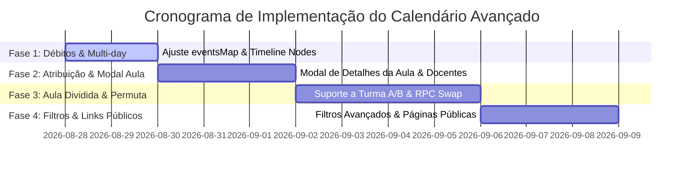

# Plano — Gestão Avançada do Calendário Acadêmico (`/academico_calendario`)

## Visão Geral

Este plano estabelece a evolução da tela de **Calendário Acadêmico** (`/academico_calendario`), resolvendo as divergências e débitos técnicos atuais e implementando recursos avançados de gestão pedagógica, atribuição docente em tempo real, divisão de turmas, permuta de aulas e geração de links públicos.

---

## 1. Resolução das Divergências e Débitos Existentes

Antes das novas funcionalidades, a base do calendário será nivelada com a documentação:

| Item | Ação Técnica |
|---|---|
| **Eventos Multi-day na Grade** | Implementar `expandMultiDay()` em `useCalendarioCalendario.ts` para que eventos retornados da RPC com `data_inicio` e `data_fim` sejam corretamente expandidos e indexados no `eventsMap`. |
| **Clique no Nó `+` da Timeline** | Ajustar `CalendarioTabFeriados.vue` e `CalendarioTabEventos.vue` para que o clique no nó circular com `+` abra o modal preenchendo automaticamente o mês selecionado. |
| **Centralização nos Composables** | Mover as chamadas `$fetch` de criação/edição dos modais `ModalFeriado.vue` e `ModalEvento.vue` para métodos `saveFeriado` e `saveEvento` nos composables correspondentes. |

---

## 2. Novas Funcionalidades

### 2.1 Modal de Detalhes e Definição da Aula

Ao clicar sobre o card de uma aula no grid mensal ou semanal:

- **Definição de Componente Curricular:** exibe e permite alterar o componente lecionado naquela data específica.
- **Puxamento Automático de Docente:** ao selecionar o componente, o sistema consulta a tabela de atribuição (`aca_docente_modulo_componente_ciclo`) criada no módulo `/atribuicao` e preenche automaticamente o docente titular.
- **Override de Docente:** permite selecionar um docente substituto ou auxiliar para a data específica sem alterar a atribuição geral do ciclo.
- **Observações da Aula:** campo de plano de aula/pauta do dia.

---

### 2.2 Suporte a Aula Dividida (Turma A e Turma B)

Para cenários onde laboratórios ou salas possuem capacidade física reduzida (ex: 12 alunos por turma):

- **Ação "Dividir Aula":** opção no modal da aula para fracionar a sessão em duas sub-turmas (Turma A e Turma B) no mesmo dia/horário.
- **Divisão Alfabética Automática:** o sistema busca a lista de matriculados no ciclo (`aca_matricula_ciclo`), ordena alfabeticamente os alunos por nome e divide a turma em 50% para a Turma A e 50% para a Turma B.
- **Instâncias de Aula:** cria duas instâncias associadas em `aca_calendario`, permitindo associar componentes e/ou professores distintos para cada sub-turma ou horários defasados no mesmo dia.

---

### 2.3 Filtros Avançados de Calendário

Expansão dos controles de filtro da barra superior:

1. **Por Oferta / Programa** (existente).
2. **Por Ciclo:** refina o grid para um ciclo/turma específico do programa.
3. **Por Componente Curricular:** isola as aulas de uma disciplina/módulo.
4. **Por Docente (Visão Transversal):** permite selecionar um professor e visualizar todas as aulas ministradas por ele, unificando diferentes programas e ciclos da entidade.

---

### 2.4 Permuta Inteligente de Aulas via Drag-and-Drop (Swap / Pular Aula)

Ao arrastar (*drag-and-drop*) um card de aula para uma data onde **já existe outra aula agendada**:

- **Mecanismo de Permuta (Swap):**
  - A aula arrastada ocupa a nova data solicitada.
  - A aula receptora que ocupava aquele dia pula automaticamente para o dia que ficou vago (ou para a data de origem).
- **RPC dedicada `aca_swap_aulas`:** executa a troca atômica dentro de uma transação PostgreSQL.
- **Histórico & Notificação (Futuro):** registra o log da permuta e enfileira um e-mail de notificação para os docentes afetados.

---

### 2.5 Páginas Públicas com Links Dinâmicos

Disponibilização de visões de calendário com acesso público (sem necessidade de autenticação no painel administrativo):

- **Calendário Público de Ciclo:** Rota `/p/calendario/ciclo/:id_ciclo`
  - Exibe o cronograma de aulas do ciclo/turma formatado para consulta de alunos.
- **Calendário Público de Docente:** Rota `/p/calendario/docente/:id_docente`
  - Exibe a grade horária e locação de aulas do professor em formato de agenda.
- **Arquitetura & Segurança:**
  - BFF em `server/api/public/calendario/*.get.ts`.
  - RPCs públicas com `SECURITY INVOKER` ou consulta com RLS permissiva de leitura para registros com flag pública.

---

## 3. Arquitetura e Modelagem de Banco de Dados

### 3.1 Alterações no Schema (`aca_calendario`)

Estruturas a serem suportadas via nova migration (sem alterar migrations testadas anteriores):

```sql
ALTER TABLE public.aca_calendario
  ADD COLUMN IF NOT EXISTS id_componente UUID REFERENCES public.aca_componente(id) ON DELETE SET NULL,
  ADD COLUMN IF NOT EXISTS sub_turma TEXT NULL, -- Ex: 'A', 'B' ou NULL (turma inteira)
  ADD COLUMN IF NOT EXISTS id_aula_parceira UUID REFERENCES public.aca_calendario(id) ON DELETE SET NULL, -- Referência à aula dividida
  ADD COLUMN IF NOT EXISTS id_docente_override UUID REFERENCES public.aca_docente(id) ON DELETE SET NULL;
```

### 3.2 Novas RPCs PostgreSQL

- `aca_swap_aulas(p_id_aula_1 UUID, p_id_aula_2 UUID, p_id_entidade UUID)`: faz a permuta atômica das datas de duas aulas.
- `aca_dividir_aula(p_id_aula UUID, p_id_componente_b UUID, p_id_docente_b UUID, p_id_entidade UUID)`: clona a aula para Turma A e Turma B.
- `aca_get_calendario_docente_publico(p_id_docente UUID)`: busca a agenda consolidada do docente.
- `aca_get_calendario_ciclo_publico(p_id_ciclo UUID)`: busca o calendário público do ciclo.

> [!NOTE]
> Conforme diretrizes de segurança, as RPCs utilizarão `SECURITY INVOKER`. As páginas públicas consultarão endpoints BFF com tratamento e sanitização adequada dos dados.

---

## 4. Cronograma de Implementação



---

## 5. Histórico de Versões

| Data | Autor | Descrição |
|---|---|---|
| 2026-08-27 | EduClick AI | Criação do plano inicial de evolução da Gestão do Calendário. |
