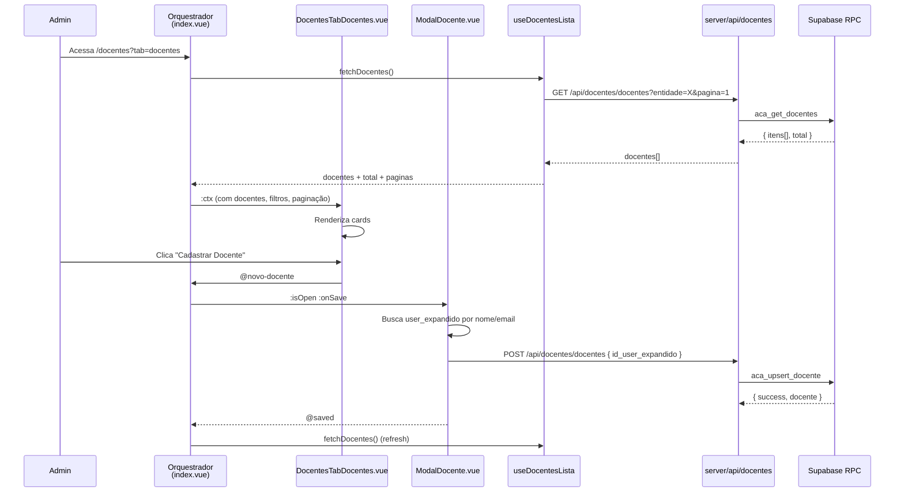

# Plano — Gestão de Docentes (`/docentes`) + Trabalhe Conosco (`/trabalhe_conosco`)

## Visão Geral

Módulo **administrativo** para gestão completa de docentes: captação (editais + currículo espontâneo), cadastro com vínculo a componentes curriculares, e seleção de candidatos.

**Inspiração direta nas páginas `/matriculas` e `/processos`** — mesma arquitetura desacoplada, mesmo padrão de cards com paginação, abas dinâmicas e modais.

---

## Funcionalidades

### Estrutura da Página (Admin)

```
┌──────────────────────────────────────────────────────────────────────┐
│  Docentes                                                             │
├──────────────────────────────────────────────────────────────────────┤
│  [📋 Editais]  [🔍 Seleção]  [👨‍🏫 Docentes]  [📄 Currículos]        │ ← Abas
├──────────────────────────────────────────────────────────────────────┤
│  (Conteúdo varia por aba)                                            │
└──────────────────────────────────────────────────────────────────────┘
```

### 4 Abas

| Aba | Finalidade | Comportamento Principal |
|---|---|---|
| **📋 Editais** | Criar/gerenciar editais de seleção docente | CRUD com formulário associado, ativar/inativar |
| **🔍 Seleção** | Avaliar candidatos inscritos nos editais | Cards + modal de avaliação (aprovar/recusar/suplente) |
| **👨‍🏫 Docentes** | Cadastro de docentes + vínculo com componentes | Similar a Matrículas: cards + modal cadastro + modal vínculos |
| **📄 Currículos** | Propostas espontâneas da página pública | Lista com flags "visto" e "considerado" |

---

### Aba 1 — 📋 Editais (`DocentesTabEditais`)

```
┌──────────────────────────────────────────────────────┐
│  [Novo Edital]                                       │ ← Botão de criação
├──────────────────────────────────────────────────────┤
│ ┌──────────────────────────────────────────────────┐ │
│ │ Edital: Seleção Docentes 2026.2                  │ │
│ │ Período: 01/08/2026 — 31/08/2026  ● Ativo        │ │
│ │ Formulário: Formulário Docente Padrão             │ │
│ │ Inscrições: 23 candidatos            [Editar] [×] │ │
│ └──────────────────────────────────────────────────┘ │
│ ┌──────────────────────────────────────────────────┐ │
│ │ Edital: Credenciamento Matemática                │ │
│ │ Período: 01/07/2026 — 15/07/2026  ○ Inativo      │ │
│ │ Formulário: Credenciamento Docente                │ │
│ │ Inscrições: 5 candidatos             [Editar] [×] │ │
│ └──────────────────────────────────────────────────┘ │
└──────────────────────────────────────────────────────┘
```

#### Ações
- **Novo Edital** → Modal com: nome, descrição, data_ini, data_fim, formulário associado (dropdown de `aca_form_config`), status ativo/inativo
- **Editar** → Mesmo modal preenchido
- **Excluir** → Confirmação com `DELETE` no BFF (cascade removal das inscrições)
- **Badge de inscrições** → contagem via RPC `aca_get_inscricoes_por_edital`

---

### Aba 2 — 🔍 Seleção (`DocentesTabSelecao`)

```
┌──────────────────────────────────────────────────────┐
│  Edital: [Seleção Docentes 2026.2        ▼]          │ ← Dropdown de edital
├──────────────────────────────────────────────────────┤
│ ┌──────────────────────────────────────────────────┐ │
│ │ 👤 Maria Santos              ○ Aguardando        │ │
│ │ maria@email.com                                   │ │
│ │ Inscrito: 05/08/2026              [Avaliar]      │ │
│ └──────────────────────────────────────────────────┘ │
│ ┌──────────────────────────────────────────────────┐ │
│ │ 👤 João Pereira              ✓ Aprovado          │ │
│ │ joao@email.com                                   │ │
│ │ Inscrito: 03/08/2026              [Avaliar]      │ │
│ └──────────────────────────────────────────────────┘ │
│ ┌──────────────────────────────────────────────────┐ │
│ │ 👤 Ana Costa                 ✕ Recusado          │ │
│ │ ana@email.com                                    │ │
│ │ Inscrito: 01/08/2026              [Avaliar]      │ │
│ └──────────────────────────────────────────────────┘ │
│                                                     │
│  ← Anterior  1  2  3  Próximo →                    │ ← Paginação
└──────────────────────────────────────────────────────┘
```

#### Ações
- **Dropdown de edital** → filtra candidatos por edital
- **Cards** com: foto/avatar, nome, email, data de inscrição, badge de status
- **Modal de Avaliação** → exibe respostas do formulário (reusa padrão de `ProcessosModalDetalhes`) + botões: **Aprovar** (verde), **Recusar** (vermelho), **Suplente** (âmbar)
- **Reatividade** → badge atualiza in-place no card
- **Status**: `aguardando` (âmbar), `aprovado` (verde), `recusado` (vermelho), `suplente` (laranja)

---

### Aba 3 — 👨‍🏫 Docentes (`DocentesTabDocentes`)

```
┌──────────────────────────────────────────────────────┐
│  [Cadastrar Docente]  [🔗 Link de Autocadastro]     │ ← Ações
├──────────────────────────────────────────────────────┤
│  [Busca nome/email...]                               │ ← Filtro
├──────────────────────────────────────────────────────┤
│ ┌──────────────────────────────────────────────────┐ │
│ │ 👤 Prof. Carlos Andrade           ● Ativo        │ │
│ │ carlos@email.com                                  │ │
│ │ Componentes: Cálculo I, Álgebra Linear            │ │
│ │ Cadastro: 10/03/2026    [Vínculos] [Desativar]   │ │
│ └──────────────────────────────────────────────────┘ │
│ ┌──────────────────────────────────────────────────┐ │
│ │ 👤 Profa. Juliana Mendes         ○ Inativo       │ │
│ │ juliana@email.com                                │ │
│ │ Componentes: —                   [Vínculos] [Ativar]│
│ └──────────────────────────────────────────────────┘ │
│                                                     │
│  ← Anterior  1  2  3  Próximo →                    │ ← Paginação
└──────────────────────────────────────────────────────┘
```

#### Ações
- **Cadastrar Docente** → Modal com busca de `user_expandido` (nome/email/CPF). Se encontrar, vincula como docente. Se não, opção de criar link de autocadastro.
- **Link de Autocadastro** → Gera/mostra URL pública do tipo `/cadastro-docente?token=...` (pode ser feito depois — MVP apenas exibe o link).
- **Cards** com: foto/avatar, nome, email, badge ativo/inativo, lista de componentes que leciona, data de cadastro
- **Vínculos** → Modal com checkboxes de `aca_componente` para definir elegibilidade
- **Ativar/Desativar** → toggle de `ativo` no banco, com reatividade in-place

---

### Aba 4 — 📄 Currículos (`DocentesTabCurriculos`)

```
┌──────────────────────────────────────────────────────┐
│  [Filtrar: Todas  |  Não vistas  |  Consideradas]   │ ← Filtro de status
├──────────────────────────────────────────────────────┤
│ ┌──────────────────────────────────────────────────┐ │
│ │ 📎 Pedro Alves           ● Novo                  │ │
│ │ pedro@email.com  (11) 99999-8888                  │ │
│ │ "Sou professor há 10 anos..."                     │ │
│ │ Enviado: 05/08/2026  [📄 Currículo] [✓ Visto]    │ │
│ └──────────────────────────────────────────────────┘ │
│ ┌──────────────────────────────────────────────────┐ │
│ │ 📎 Carla Souza           ✓ Visto — ⭐ Chamar    │ │
│ │ carla@email.com                                   │ │
│ │ "Mestre em Matemática..."                         │ │
│ │ Enviado: 01/08/2026  [📄 Currículo] [📞 Chamar]  │ │
│ └──────────────────────────────────────────────────┘ │
└──────────────────────────────────────────────────────┘
```

#### Ações
- **Filtro por status**: Todas / Não vistas / Vistas / Consideradas
- **Mini bio** exibida em 2 linhas (expandível)
- **📄 Currículo** → link para download (signed URL do `global_arquivos`)
- **✓ Visto** → marca `visto = true` no banco
- **📞 Chamar / ⭐ Considerar** → marca `considerado = true`
- **✕ Dispensar** → marca `considerado = false`
- Badge "Novo" para `visto = false`

---

## Página Pública: `/trabalhe_conosco`

Página **pública** (sem login, `layout: false`, sem entrada no menu admin) para receber currículos e propostas espontâneas, além de exibir editais abertos.

**Inspiração na página `/oferta`** — mesmo layout público, hero, cards.

### Estrutura da Página

```
┌──────────────────────────────────────────────────────┐
│  Header (logo + navegação + Entrar/Cadastrar)        │
├──────────────────────────────────────────────────────┤
│  Hero: "Trabalhe Conosco" + descrição                │
├──────────────────────────────────────────────────────┤
│  Se houver editais abertos:                          │
│  ┌──────────────────────────────────────────────────┐│
│  │ 📋 Editais Abertos                               ││
│  │ ┌────────────────────┐ ┌────────────────────┐   ││
│  │ │ Seleção Docentes   │ │ Credenciamento     │   ││
│  │ │ 2026.2             │ │ Matemática         │   ││
│  │ │ Até 31/08          │ │ Até 15/07          │   ││
│  │ │ [Inscrever-se]     │ │ [Inscrever-se]     │   ││
│  │ └────────────────────┘ └────────────────────┘   ││
│  └──────────────────────────────────────────────────┘│
│                                                      │
│  Seção: "Envio Espontâneo de Currículo"              │
│  ┌──────────────────────────────────────────────────┐│
│  │  Nome completo:  [________________________]     ││
│  │  Email:          [________________________]     ││
│  │  Telefone:       [________________________]     ││
│  │  Mini bio:       [________________________]     ││
│  │                  [________________________]     ││
│  │  Currículo:      [📎 Selecionar arquivo]       ││
│  │                                                ││
│  │  [📤 Enviar Currículo]                         ││
│  └──────────────────────────────────────────────────┘│
├──────────────────────────────────────────────────────┤
│  Footer                                              │
└──────────────────────────────────────────────────────┘
```

### Comportamento
- **Editais abertos** (`status = 'ativo'` e `data_fim >= NOW()`) → cards clicáveis que levam ao formulário de inscrição
- **Formulário espontâneo** → sempre visível, independente de haver editais ou não. Se o usuário escolher um edital, associa a proposta ao edital.
- Após envio: tela de sucesso simples ("Recebemos seu currículo! Entraremos em contato.")

---

## Pipeline de Dados

```
Orquestrador → Componente → Composable → BFF → RPC → Banco
```

```
app/pages/docentes/index.vue                              ← orquestrador (~80 linhas)
app/pages/trabalhe-conosco.vue                            ← página pública (~200 linhas)

app/components/docentes/
├── DocentesTabEditais.vue                                 ← CRUD editais (cards)
├── DocentesTabSelecao.vue                                 ← candidatos + avaliação
├── DocentesTabDocentes.vue                                ← lista docentes + cards
├── DocentesTabCurriculos.vue                              ← propostas recebidas
├── ModalEdital.vue                                        ← criar/editar edital
├── ModalDocente.vue                                       ← cadastrar docente manual
├── ModalAvaliarCandidato.vue                              ← avaliar inscrição
└── ModalVinculosDocente.vue                               ← vincular componentes

app/composables/docentes/
├── useDocentesCore.ts                                     ← abas + entidade
├── useDocentesEditais.ts                                 ← CRUD editais
├── useDocentesSelecao.ts                                 ← inscrições + avaliação
├── useDocentesLista.ts                                   ← CRUD docentes + vínculos
└── useDocentesCurriculos.ts                              ← propostas + flags

server/api/docentes/
├── editais.get.ts                                         ← GET listar editais
├── editais.post.ts                                        ← POST criar/atualizar
├── editais.delete.ts                                      ← DELETE excluir
├── inscricoes.get.ts                                      ← GET inscrições por edital
├── inscricoes.post.ts                                     ← POST avaliar inscrição
├── docentes.get.ts                                        ← GET listar docentes
├── docentes.post.ts                                       ← POST criar docente
├── docentes.delete.ts                                     ← DELETE desativar
├── vinculos.post.ts                                       ← POST salvar vínculos
├── vinculos.get.ts                                        ← GET vínculos do docente
├── curriculos.get.ts                                      ← GET listar propostas
├── curriculos.post.ts                                     ← POST marcar visto/considerado
└── curriculos.delete.ts                                   ← DELETE excluir proposta

server/api/public/
└── trabalhe-conosco.post.ts                               ← POST receber currículo (público)
```

---

## Banco de Dados — Estrutura Proposta

### 1. `aca_docente` — Cadastro de docentes

```sql
CREATE TABLE public.aca_docente (
    id UUID PRIMARY KEY DEFAULT gen_random_uuid(),
    id_entidade UUID NOT NULL REFERENCES public.user_entidades(id) ON DELETE CASCADE,
    id_user_expandido UUID NOT NULL REFERENCES public.user_expandido(id),
    ativo BOOLEAN NOT NULL DEFAULT true,

    criado_por UUID REFERENCES public.user_expandido(id),
    criado_em TIMESTAMPTZ NOT NULL DEFAULT NOW(),
    modificado_por UUID REFERENCES public.user_expandido(id),
    modificado_em TIMESTAMPTZ,

    UNIQUE(id_entidade, id_user_expandido)
);
```

### 2. `aca_docente_vinculo` — Vínculo docente × componente

```sql
CREATE TABLE public.aca_docente_vinculo (
    id UUID PRIMARY KEY DEFAULT gen_random_uuid(),
    id_docente UUID NOT NULL REFERENCES public.aca_docente(id) ON DELETE CASCADE,
    id_componente UUID NOT NULL REFERENCES public.aca_componente(id),  -- tabela existente
    elegivel BOOLEAN NOT NULL DEFAULT true,

    criado_por UUID REFERENCES public.user_expandido(id),
    criado_em TIMESTAMPTZ NOT NULL DEFAULT NOW(),
    modificado_por UUID REFERENCES public.user_expandido(id),
    modificado_em TIMESTAMPTZ,

    UNIQUE(id_docente, id_componente)
);
```

### 3. `aca_edital_docente` — Editais de seleção

```sql
CREATE TABLE public.aca_edital_docente (
    id UUID PRIMARY KEY DEFAULT gen_random_uuid(),
    id_entidade UUID NOT NULL REFERENCES public.user_entidades(id) ON DELETE CASCADE,
    nome TEXT NOT NULL,
    descricao TEXT,
    data_ini DATE NOT NULL,
    data_fim DATE NOT NULL,
    status TEXT NOT NULL DEFAULT 'ativo' CHECK (status IN ('ativo', 'inativo')),
    id_form_config UUID REFERENCES public.aca_form_config(id) ON DELETE SET NULL,

    criado_por UUID REFERENCES public.user_expandido(id),
    criado_em TIMESTAMPTZ NOT NULL DEFAULT NOW(),
    modificado_por UUID REFERENCES public.user_expandido(id),
    modificado_em TIMESTAMPTZ
);
```

### 4. `aca_edital_docente_inscricao` — Inscrições nos editais

```sql
CREATE TABLE public.aca_edital_docente_inscricao (
    id UUID PRIMARY KEY DEFAULT gen_random_uuid(),
    id_edital UUID NOT NULL REFERENCES public.aca_edital_docente(id) ON DELETE CASCADE,
    id_candidato UUID NOT NULL REFERENCES public.user_expandido(id),
    status TEXT NOT NULL DEFAULT 'aguardando'
        CHECK (status IN ('aguardando', 'aprovado', 'recusado', 'suplente')),

    criado_por UUID REFERENCES public.user_expandido(id),
    criado_em TIMESTAMPTZ NOT NULL DEFAULT NOW(),
    modificado_por UUID REFERENCES public.user_expandido(id),
    modificado_em TIMESTAMPTZ,

    UNIQUE(id_edital, id_candidato)
);
```

### 5. `aca_docente_proposta` — Currículos / Propostas espontâneas

```sql
CREATE TABLE public.aca_docente_proposta (
    id UUID PRIMARY KEY DEFAULT gen_random_uuid(),
    id_entidade UUID NOT NULL REFERENCES public.user_entidades(id) ON DELETE CASCADE,
    id_edital UUID REFERENCES public.aca_edital_docente(id) ON DELETE SET NULL, -- opcional
    nome TEXT NOT NULL,
    telefone TEXT,
    email TEXT NOT NULL,
    minibio TEXT,
    id_curriculo UUID REFERENCES public.global_arquivos(id) ON DELETE SET NULL,
    visto BOOLEAN NOT NULL DEFAULT false,
    considerado BOOLEAN,  -- null=pendente, true=chamar, false=dispensar

    criado_em TIMESTAMPTZ NOT NULL DEFAULT NOW(),
    modificado_em TIMESTAMPTZ
);
```

### 6. RPCs Necessárias

| RPC | Descrição | Pipeline |
|---|---|---|
| `aca_get_docentes` | Lista docentes com vínculos (paginada) | `aca_docente JOIN user_expandido LEFT JOIN aca_docente_vinculo` |
| `aca_upsert_docente` | Criar docente manual | INSERT `aca_docente` com validação de unique |
| `aca_get_editais_docente` | Listar editais | `aca_edital_docente WHERE id_entidade` |
| `aca_upsert_edital_docente` | Criar/atualizar edital | INSERT ON CONFLICT |
| `aca_delete_edital_docente` | Excluir edital | DELETE (cascade inscrições) |
| `aca_get_inscricoes_edital` | Inscrições por edital (paginada) | `aca_edital_docente_inscricao JOIN user_expandido` |
| `aca_avaliar_inscricao_docente` | Mudar status da inscrição | UPDATE status |
| `aca_get_vinculos_docente` | Vínculos de um docente | `aca_docente_vinculo WHERE id_docente` |
| `aca_upsert_vinculos_docente` | Salvar lote de vínculos | DELETE + INSERT batch |
| `aca_get_propostas_docente` | Listar propostas (paginada) | `aca_docente_proposta WHERE id_entidade` |
| `aca_marcar_visto_proposta` | Marcar como visto | UPDATE visto = true |
| `aca_considerar_proposta` | Marcar como considerado | UPDATE considerado |

---

## Diagrama de Fluxo



---

## Componentes vs Matrículas — Paralelo

| Elemento | `/matriculas` | `/docentes` |
|---|---|---|
| Tabela principal | `aca_matricula` | `aca_docente` |
| Abas | 0 (simples) | 4 (editais, seleção, docentes, currículos) |
| Orquestrador | `pages/matriculas/index.vue` | `pages/docentes/index.vue` |
| Componente lista | `MatriculasList.vue` | `DocentesTabDocentes.vue` |
| Modal cadastro | `—` (via formulário) | `ModalDocente.vue` (busca user_expandido) |
| Modal detalhes | `MatriculasModalDetalhes.vue` | `ModalAvaliarCandidato.vue` (seleção) |
| Vínculos | Turma (simples) | Componentes (N:N) |
| Fotos | Via `aca_resposta_form` | Via `user_expandido` (já tem) |

---

## Contrato Visual Aplicado

(mesmo design system do EduClick — ver `contrato-visual.md`)

- **Layout**: `base` com sidebar (admin autenticado)
- **Tabs**: `tabs-nav` com `tab-btn` / `tab-btn--active`
- **Cards**: `bg-[#0f0f17] border border-white/5 rounded-xl` com hover `border-primary/30`
- **Badges de status**: `text-[8px] font-black uppercase tracking-wider px-2 py-0.5 rounded border`
  - Aguardando: `bg-amber-500/10 border-amber-500/20 text-amber-400`
  - Aprovado/Ativo: `bg-emerald-500/10 border-emerald-500/20 text-emerald-400`
  - Recusado: `bg-red-500/10 border-red-500/20 text-red-400`
  - Suplente: `bg-orange-500/10 border-orange-500/20 text-orange-400`
  - Inativo: `bg-white/[0.04] border-white/10 text-white/40`
  - Novo (não visto): `bg-sky-500/10 border-sky-500/20 text-sky-400`
- **Avatar**: 48×48 `rounded-xl border border-primary/20`, fallback com inicial
- **Modais**: overlay `rgba(0,0,0,0.85)`, painel `#13131a`, accent bar gradient
- **Botões**: padrão do design system (primary violeta, outline, danger)
- **Layout público (/trabalhe-conosco)**: `layout: false`, igual `/oferta`

---

## Estados da UI

| Estado | Renderização |
|---|---|
| `isLoading` (inicial) | Spinner centralizado |
| `editais.length === 0` | Empty state "Nenhum edital criado" + botão "Criar Primeiro Edital" |
| `inscricoes.length === 0` | "Nenhuma inscrição para este edital" |
| `docentes.length === 0` | "Nenhum docente cadastrado" + botão "Cadastrar Docente" |
| `propostas.length === 0` | "Nenhum currículo recebido" |
| `total > 0` | Paginação fixa no rodapé |
| Normal | Cards com dados conforme a aba |

---

## Observações e Riscos

1. **Tabelas novas vs existentes**: Todas as 5 tabelas são novas, sem impacto em migrations existentes. O prefixo `aca_` mantém consistência com o módulo acadêmico.
2. **`user_expandido` como docente**: Um mesmo usuário pode ser aluno e docente ao mesmo tempo. A UNIQUE está em `(id_entidade, id_user_expandido)` para evitar duplicidade por entidade.
3. **Formulário de inscrição**: Reusa o módulo de formulários existente. Os editais apontam para `aca_form_config` via `id_form_config`. Quando o candidato se inscreve, as respostas ficam em `aca_resposta_form` (já existente).
4. **Foto do docente**: `user_expandido` já tem estrutura de foto (via `global_arquivos`), então não precisamos de uma coluna extra.
5. **Página `/trabalhe-conosco`**: É pública (`layout: false`), sem autenticação. O POST de currículo será um endpoint público que insere na `aca_docente_proposta`.
6. **Currículo upload**: Usa `global_arquivos` + R2, mesma estrutura de upload de arquivos já existente no sistema.
7. **Permissões**: As RPCs devem usar `SECURITY INVOKER`. As novas tabelas precisarão de RLS policies para admin da entidade.
8. **Formulário de inscrição do edital**: Quando um candidato se inscreve via página pública, as respostas vão para `aca_resposta_form` (tabela existente), reusando todo o pipeline de formulários já consolidado.

---

## Ordem de Implementação

| Etapa | O que | Status |
|---|---|---|
| **1** | Migrations: 5 tabelas (`aca_docente`, `aca_docente_vinculo`, `aca_edital_docente`, `aca_edital_docente_inscricao`, `aca_docente_proposta`) | ✅ |
| **2** | RPCs de docente (listar, upsert, toggle) | ✅ |
| **3** | RPCs de edital (listar, upsert, delete) | ✅ |
| **4** | RPCs de inscrição (listar, avaliar) | ✅ |
| **5** | RPCs de vínculo (listar, upsert batch) | ✅ |
| **6** | RPCs de proposta (listar, marcar visto, considerar, inserir pública) | ✅ |
| **7** | BFFs (17 endpoints) | ✅ |
| **8-12** | 5 Composables (`Core`, `Editais`, `Selecao`, `Lista`, `Curriculos`) | ✅ |
| **13-16** | 8 Componentes (4 tabs + 4 modais) | ✅ |
| **17** | Orquestrador `pages/docentes/index.vue` | ✅ |
| **18** | Página pública `/trabalhe-conosco` + BFF público | ✅ |
| **19** | `pageTitle` para `/docentes` no layout | ✅ |

### 🚧 Extras implementados (além do plano original)

| Extra | Migração | Descrição |
|---|---|---|
| **Convite/Autocadastro** | `20260713100007` | Tabela `aca_docente_convite` + RPCs `gerar_convite` e `completar_cadastro` |
| **Verificação de email** | `20260713100008` | Colunas em `user_expandido` + RPCs `gerar_codigo_verificacao` e `verificar_codigo` |
| **Valor hora/aula** | `20260713100009` | Coluna `valor_hora_aula` em `aca_docente` + edição inline |
| **Cadastro completo** | `20260713100010` | RPC `aca_criar_docente_completo` com `p_valor_hora_aula` |
| **Escopo Global** | `20260713100011` | Coluna `escopo` em `aca_form_config` + form builder atualizado |
| **Acesso público** | `20260713100012` | Grant anon para envio de currículo público |

### 📋 Próximos passos (fora deste plano)

- **Atribuição de Docentes** — vincular professor a aulas no calendário acadêmico
- **Power Automate** — envio automático de email com link de convite
- **Página pública de inscrição em edital** — candidato se inscreve via formulário do edital
- **Página `/cadastro-docente`** — tela de verificação de código após signup

---

## Histórico

| Data | Descrição |
|---|---|
| 2026-07-13 | Criação do plano — gestão completa de docentes com 4 abas + página pública Trabalhe Conosco |
| 2026-07-13 | Implementação completa (19 etapas + 6 extras). Build 100% OK. |
