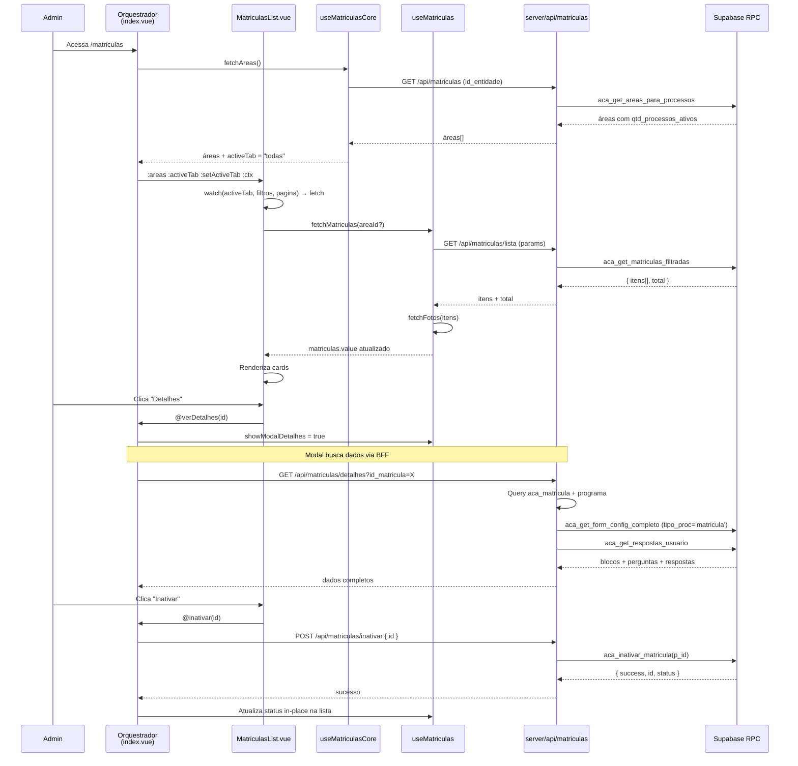

# Plano — Página de Matrículas (`/matriculas`)

## Visão Geral

Página **administrativa** para gestão de matrículas de alunos nos programas acadêmicos.

**Inspiração direta na página `/processos`** — mesma arquitetura, mesmos padrões visuais, mesma pipeline desacoplada. A diferença é que em vez da tabela `aca_processo_seletivo_inscricoes`, trabalhamos com `aca_matricula`.

---

## Funcionalidades

### Estrutura da Página

```
┌─────────────────────────────────────────────────────┐
│  Matrículas                                    3 área(s) │
├─────────────────────────────────────────────────────┤
│  [Todas]  [Área A]  [Área B]  [Área C]            │ ← Abas dinâmicas por Área
├─────────────────────────────────────────────────────┤
│  [Semestre ▼]  [Turma ▼]  [Busca nome/email...]   │ ← Filtros
├─────────────────────────────────────────────────────┤
│  ┌──────────────────────────────────────────┐       │
│  │ 👤 João Silva                            │       │ ← Card de aluno
│  │ joao@email.com                          │       │
│  │ Programa: Bacharelado em Direito        │       │
│  │ Turma: 2026.1 / Área: Direito           │       │
│  │ Status: ● Ativa                         │       │
│  │ Matrícula: 12/03/2026                   │       │
│  │                        [Detalhes] [Inativar] │   │ ← Ações
│  └──────────────────────────────────────────┘       │
│  ┌──────────────────────────────────────────┐       │
│  │ 👤 Maria Santos                          │       │
│  │ ...                                      │       │
│  └──────────────────────────────────────────┘       │
│                                                     │
│  ← Anterior  1  2  3 ... 9  10  Próximo →          │ ← Paginação
└─────────────────────────────────────────────────────┘
```

### Cards de Matrícula
- **Avatar/Foto** — foto via `aca_resposta_form` (pergunta global "sua_foto"), fallback com inicial
- **Nome completo** + **Email** do aluno (`user_expandido`)
- **Programa** — `aca_programa.descricao`
- **Turma** — `aca_ciclo.descricao` (via `aca_ciclo_programa`)
- **Área** — `aca_area.nome_area`
- **Status da matrícula** — badge: Ativa (verde) / Inativa (cinza) / Cancelada (vermelho)
- **Data da matrícula** — `aca_matricula.criado_em`

### Filtros
| Filtro | Tipo | Comportamento |
|---|---|---|
| **Área** | Abas dinâmicas | Recarrega matrículas via RPC |
| **Ano/Semestre** | Dropdown | Recarrega via RPC (formato `26Is`) |
| **Turma** | Dropdown | Recarrega via RPC (lista de `aca_ciclo` disponíveis) |
| **Busca** | Input texto | Recarrega via RPC (busca por nome ou email) |

### Ações por Card

#### 🔍 Detalhes
Abre modal com:
- Dados do aluno (nome, email, tipo candidatura)
- Programa, área, turma, data matrícula
- **Todas as respostas do formulário de matrícula** — blocos com perguntas e respostas (igual ao `ProcessosModalDetalhes`, mas com `tipo_proc = 'matricula'`)

#### ⛔ Inativar
- Ação rápida: Confirmação no próprio card ou modal pequeno
- Muda o `status` da matrícula para `'inativa'`
- Badge no card atualiza instantaneamente (reatividade)

---

## Pipeline de Dados

```
Orquestrador → Componente → Composable → BFF → RPC → Banco
```

```
app/pages/matriculas/index.vue                           ← orquestrador (~60 linhas)
app/components/matriculas/
├── MatriculasList.vue                                    ← tabs + filtros + cards + paginação
└── MatriculasModalDetalhes.vue                           ← respostas do formulário em modo leitura
app/composables/matriculas/
├── useMatriculasCore.ts                                  ← áreas, tabs, entidade
└── useMatriculas.ts                                      ← fetch matrículas, filtros, paginação, fotos
server/api/matriculas/
├── index.get.ts                                          ← GET áreas (RPC aca_get_areas_para_processos)
├── lista.get.ts                                          ← GET matrículas paginadas
├── detalhes.get.ts                                       ← GET dados completos (form + respostas)
└── inativar.post.ts                                      ← POST inativar matrícula
supabase/migrations/
├── 202607XXXXXX01_add_status_to_aca_matricula.sql        ← ADD COLUMN status + CHECK
├── 202607XXXXXX02_rpc_aca_get_matriculas_filtradas.sql   ← RPC principal (paginada)
├── 202607XXXXXX03_rpc_aca_inativar_matricula.sql         ← RPC de inativar
└── 202607XXXXXX04_rpc_fix_matriculas_foto.sql            ← (se necessário, foto)
```

---

## Banco de Dados — Mudanças Necessárias

### 1. `aca_matricula` — Adicionar coluna `status`

```sql
ALTER TABLE public.aca_matricula 
ADD COLUMN IF NOT EXISTS status TEXT NOT NULL DEFAULT 'ativa';

ALTER TABLE public.aca_matricula 
ADD CONSTRAINT chk_aca_matricula_status 
CHECK (status IN ('ativa', 'inativa', 'cancelada'));

-- Índice para filtrar por status
CREATE INDEX IF NOT EXISTS idx_aca_matricula_status
    ON public.aca_matricula (status);
```

### 2. RPC `aca_get_matriculas_filtradas` (nova)

Padrão idêntico ao `aca_get_inscricoes_filtradas` v3 (com paginação):

```sql
CREATE OR REPLACE FUNCTION public.aca_get_matriculas_filtradas(
    p_id_entidade UUID,
    p_id_area UUID DEFAULT NULL,
    p_ano_semestre TEXT DEFAULT NULL,
    p_id_turma UUID DEFAULT NULL,      -- filtra por ciclo/turma
    p_busca TEXT DEFAULT NULL,
    p_status TEXT DEFAULT NULL,         -- filtra por status da matrícula
    p_pagina INTEGER DEFAULT 1,
    p_limite INTEGER DEFAULT 20
)
RETURNS JSONB
LANGUAGE plpgsql
SECURITY INVOKER
AS $$
-- Retorna:
-- {
--   "success": true,
--   "itens": [{ id, id_usuario, nome_completo, email, programa_descricao,
--               nome_area, ano_semestre, nome_turma, status, criado_em, ... }],
--   "total": N,
--   "pagina": P,
--   "limite": L
-- }
```

**JOINs:**
- `aca_matricula m` → `user_expandido ue` (aluno)
- `aca_matricula m` → `aca_programa prog` (programa)
- `prog` → `aca_area a` (área)
- `prog` → `aca_ciclo_programa cp` → `aca_ciclo c` (turma + ano_semestre)
- `ue` → `aca_resposta_form resp_foto` (foto)

### 3. RPC `aca_inativar_matricula` (nova)

```sql
CREATE OR REPLACE FUNCTION public.aca_inativar_matricula(
    p_id UUID,
    p_status TEXT DEFAULT 'inativa'
)
RETURNS JSONB
LANGUAGE plpgsql
SECURITY INVOKER
AS $$
BEGIN
    UPDATE public.aca_matricula
    SET status = p_status,
        modificado_em = NOW()
    WHERE id = p_id;

    RETURN jsonb_build_object(
        'success', true,
        'id', p_id,
        'status', p_status
    );
END;
$$;
```

### 4. RPC / BFF `detalhes` — Aproveitar existentes

Para o modal de detalhes, reutilizamos:
- `aca_get_form_config_completo(p_id_entidade, p_programa_id, p_area_id, p_tipo_proc => 'matricula', p_tipo_cand => 'estudante')`
- `aca_get_respostas_usuario(p_id_user_expandido, p_pergunta_ids)`

> **Nota:** O form config para matrícula já existe no banco com `tipo_proc = 'matricula'`. Criado na migration `20260415154500_create_form_module.sql`.

---

## Estrutura de Diretórios (Frontend)

```
front_end/app/
├── pages/matriculas/
│   └── index.vue                     ← Orquestrador (~60 linhas)
├── components/matriculas/
│   ├── MatriculasList.vue             ← Tabs + filtros + cards + paginação
│   └── MatriculasModalDetalhes.vue    ← Modal com respostas do formulário
├── composables/matriculas/
│   ├── useMatriculasCore.ts           ← Áreas, tabs, entidade
│   └── useMatriculas.ts              ← Fetch, filtros, paginação, fotos

server/api/matriculas/
├── index.get.ts                      ← GET áreas
├── lista.get.ts                      ← GET matrículas paginadas
├── detalhes.get.ts                   ← GET detalhes (form config + respostas)
└── inativar.post.ts                  ← POST inativar
```

---

## Diagrama de Fluxo



---

## Componentes vs Processos — Paralelo

| Elemento | `/processos` | `/matriculas` |
|---|---|---|
| Tabela principal | `aca_processo_seletivo_inscricoes` | `aca_matricula` |
| Orquestrador | `pages/processos/index.vue` | `pages/matriculas/index.vue` |
| Componente principal | `ProcessosTabInscritos.vue` | `MatriculasList.vue` |
| Modal detalhes | `ProcessosModalDetalhes.vue` | `MatriculasModalDetalhes.vue` |
| Modal avaliação | `ProcessosModalAvaliar.vue` | ❌ (não tem avaliação) |
| Core composable | `useProcessosCore.ts` | `useMatriculasCore.ts` |
| Data composable | `useProcessos.ts` | `useMatriculas.ts` |
| BFF áreas | `index.get.ts` | `index.get.ts` (mesma RPC) |
| BFF dados | `inscricoes.get.ts` | `lista.get.ts` |
| BFF detalhes | `detalhes.get.ts` | `detalhes.get.ts` |
| BFF ação | `avaliar.post.ts` | `inativar.post.ts` |
| Badges | 3 status (Dados/Docs/Cand) | 1 badge (Ativa/Inativa) |
| Filtro turma | ❌ | ✅ Novo |

---

## Observações e Riscos

1. **Coluna `status`**: `aca_matricula` não tem status atualmente. A migration é simples e segura (ADD COLUMN com default).
2. **Formulário de matrícula**: O form config com `tipo_proc = 'matricula'` já existe no banco. As RPCs `aca_get_form_config_completo` e `aca_get_respostas_usuario` são reutilizáveis.
3. **Foto do aluno**: Mesma pergunta global "sua_foto", referenciada via `id_user_expandido`. O BFF de detalhes pode incluir a signed URL.
4. **Turmas**: A matrícula está no nível do programa, não da turma. Para determinar a turma do aluno, precisamos definir uma estratégia (ex: mostrar a primeira turma do programa, ou adicionar `id_ciclo` na matrícula futuramente). Por enquanto, exibimos a turma primária via `aca_ciclo_programa`.
5. **Permissões**: A tabela `aca_matricula` já tem RLS policies para admin da entidade (criada na migration `20260709000001_fix_aca_matricula_rls.sql`). As RPCs devem usar `SECURITY INVOKER` para respeitar essas policies.
6. **Reuso de áreas**: Podemos reutilizar a RPC `aca_get_areas_para_processos` para listar áreas no índice, já que ela retorna apenas áreas com programas vinculados.

---

## Ordem de Implementação

| Etapa | O que | Depende |
|---|---|---|
| 1 | Add status column + migration | Nada |
| 2 | RPC `aca_get_matriculas_filtradas` + migration | Etapa 1 |
| 3 | RPC `aca_inativar_matricula` + migration | Etapa 1 |
| 4 | BFFs (`index.get.ts`, `lista.get.ts`, `inativar.post.ts`) | Etapas 2, 3 |
| 5 | BFF `detalhes.get.ts` | Nada (reusa RPCs existentes) |
| 6 | Composable `useMatriculasCore.ts` | Nada |
| 7 | Composable `useMatriculas.ts` | Etapa 4 |
| 8 | Componente `MatriculasList.vue` | Etapas 6, 7 |
| 9 | Componente `MatriculasModalDetalhes.vue` | Etapa 5 |
| 10 | Orquestrador `pages/matriculas/index.vue` | Etapas 8, 9 |
